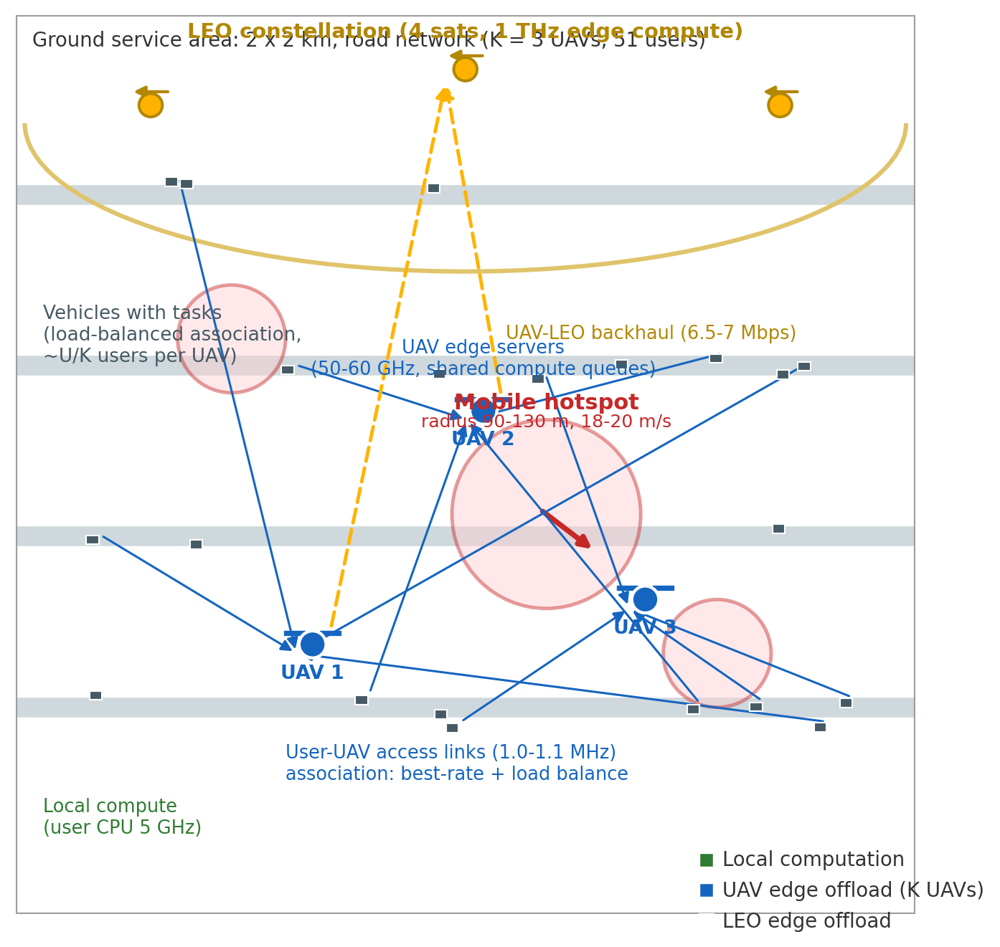

（2026-09-09 口径更新：本文档为历史内部口径；新的“相位错配 + AoI/事件触发”叙事与数据见 `pmeo_laets_upgrade_status.md`、`pmeo_laets_phase1_formalization.md`、`pmeo_laets_abstract_contrib_v1.md`。后续写作以新口径为准。）
# 导师汇报提纲（通俗版）：UAV–LEO 三层边缘计算（PMEO + LAETS）

> 用途：和导师口头/书面汇报用。尽量少用黑话，把「做了什么、怎么建模、奖励怎么设、参考谁、结果怎么说、下一步干什么」讲清楚。
> 数字口径：2026-08-25 修复版环境。Reward 是「负的代价」，数值越大越好（负得越少越好）。

---

# 一、一分钟讲清楚：我们在干什么

车联网里，车上算力不够，任务可以：

1. 自己在车上算（本地）
2. 甩给附近的无人机 UAV 算
3. 经 UAV 再传到低轨卫星 LEO 算

UAV 还会飞。飞到哪，信道好坏就变；飞得猛，还费电。

所以每个时间片（约 1 秒）要同时决定两件事：

- UAV 往哪飞（轨迹）
- 每个任务卸载到哪、卸载多少（卸载）

业界常见做法是强化学习（要长时间训练）或 MPC（多步前瞻搜索，算力更重）。我们发现一个被很多人忽略的细节：

**同一个时隙里，必须先让 UAV 飞到新位置，再在「新位置」上算卸载；如果还在「旧位置」上算卸载，就会用错信道，决策变差。**

我们把这个做成免训练方法 **PMEO**；多机再做成 **PMEO-M-Eco**。  
如果决策跑在数字孪生上，状态旧了，上面的优势会被淹没，所以又做了 **LAETS**（按负载变化触发同步）。

给导师的一句话：

> 不是再堆一个更复杂的神经网络，而是把「决策顺序」和「孪生何时刷新」做对；对比上相对主流 DRL 明显更好，多机还能打过短视界 MPC。

---

# 二、场景与系统建模（论文级细节 · 跟导师讲透）

## 2.1 网络与符号

系统由 $U$ 个车辆用户、$K$ 架 UAV、$L$ 颗 LEO、$M$ 个移动热点组成。时隙长度 $\Delta t=1\,\mathrm{s}$，回合 $T=30$ 时隙。

| 层 | 符号角色 | 通俗理解 |
|---|---|---|
| 车辆用户 | 位置 $\mathbf{x}_{u,t}$，任务比特 $b_{u,t}$ | 路上的车；热点附近任务密 |
| UAV | 水平位置 $\mathbf{p}_{k,t}$，高度 $H_{\mathrm{uav}}$ | 可飞、可算、可中继；飞近信道好但费电 |
| LEO | 位置 $\mathbf{q}_{\ell}$，高度 $H_{\mathrm{leo}}$ | 高算力回传；UAV→LEO 容量有限（主实验约 $20\,\mathrm{Mbps}$） |

**主实验规模：**

- 单机 hard：$K=1,U=12$；stress：$U=16$；路径损耗指数 $\alpha\approx 3.0$
- 多机主表：$K=3$，用户约 $51$，区域约 $2\times 2\,\mathrm{km}$
- 用户—UAV 接入带宽约 $1.0$–$1.1\,\mathrm{MHz}$

## 2.2 热点在动吗？每个时隙都变吗？

**会动，而且每个时隙都更新。**

仿真里热点沿道路网络运动：观测给出热点位置 $\mathbf{h}_t$ 与速度 $\mathbf{v}^{\mathrm{hot}}_t$（由道路方向 × 有符号速率得到，约 $18$–$20\,\mathrm{m/s}$）。每时隙末：

$$\mathbf{h}_{t+1} \leftarrow \mathrm{road\_update}(\mathbf{h}_t,\mathbf{v}^{\mathrm{hot}}_t,\Delta t)$$

碰道路端点会折返（速度变号）。用户也沿道路移动。因此「任务空间分布」每个时隙都在变 → UAV 每个时隙都要重算飞向。

平静区到达概率约 $0.05$，热点半径内约 $1.0$；并非全世界任务挤成一点。

## 2.3 车和 UAV 怎么连？出覆盖怎么办？有没有硬覆盖半径？

**实现上没有「硬切圆」式覆盖半径**（不是「超过 $R$ 米就断连、比特率为 0」）。

采用 **软连接**：用 LoS/NLoS 混合信道算香农速率 $r_{u,k}(\mathbf{p}_k)$；距离越远 → 仰角低、NLoS 概率高、路径损耗大 → **速率单调变差**。

上 LEO 时，用户**不能直连卫星**，必须经 UAV 中继：

$$r_{u\to\mathrm{LEO}} = \min\big(r_{u,k^{\star}},\ r_{k^{\star},\ell}\big)$$

其中 $k^{\star}$ 取使中继速率最大的 UAV，$r_{k,\ell}$ 主实验常用固定回传容量 $C_{\mathrm{bh}}\approx 20\,\mathrm{Mbps}$。

因此：

- 若用户离所有 UAV 都很远 → 第一跳 $r_{u,k}$ 很差 → 卸 UAV/LEO 的传输时延会很大 → 枚举时更可能选**本地**，或超时记丢弃；
- **「用户已不在无人机连接范围还硬走卫星」在模型里会自动变差**，不会被当成免费高速通道。

多机时还有 **关联（association）**：按用户—UAV 速率排序，并做负载均衡（每机最多约 $\lceil U/K\rceil$ 用户），且在 **移动后位置** 上重算关联/卸载。

## 2.4 信道与速率公式（主实验 `los_nlos`）

三维距离（用户 $\mathbf{x}$，UAV 水平位置 $\mathbf{p}$）：

$$d = \sqrt{\|\mathbf{x}-\mathbf{p}\|^2 + H_{\mathrm{uav}}^2}$$

仰角 $\theta=\arctan(H_{\mathrm{uav}}/d_{\parallel})$。LoS 概率（3GPP 风格）：

$$P_{\mathrm{LoS}}(\theta)=\frac{1}{1+a\exp(-b(\theta-a))}$$

路径损耗（dB）含自由空间项、可选指数修正 $\alpha$、以及 LoS/NLoS 额外损耗 $\eta_{\mathrm{LoS}}/\eta_{\mathrm{NLoS}}$。期望增益：

$$G = P_{\mathrm{LoS}}G_{\mathrm{LoS}}+(1-P_{\mathrm{LoS}})G_{\mathrm{NLoS}}$$

香农速率：

$$r = B\log_2\big(1+\tfrac{P_{\mathrm{tx}}G}{N_0}\big)$$

**这就是「飞到哪信道就变」的物理根；也是为什么卸载必须用移动后位置求值。**

## 2.5 时延公式

记任务比特 $b$、每比特周期 $\kappa$，总 cycles $c=b\kappa$。卸载比例 $\rho\in[0,1]$。

- 本地部分：$T^{\mathrm{loc}}=(1-\rho)\,c/f_{\mathrm{user}}$
- 传输：$T^{\mathrm{tx}}=\rho\,b/\max(r,1)$
- 排队：共享 backlog $Q$，服务速率 $f_{\mathrm{srv}}$，$T^{\mathrm{wait}}=\max(Q-f_{\mathrm{srv}}\Delta t,0)/f_{\mathrm{srv}}$
- 远端计算：$T^{\mathrm{svc}}=\rho\,c/f_{\mathrm{srv}}$

并行本地与远端时：

$$T_u=\max\big(T^{\mathrm{loc}},\ T^{\mathrm{tx}}+T^{\mathrm{wait}}+T^{\mathrm{svc}}\big)$$

全本地则 $T_u=c/f_{\mathrm{user}}$。若 $T_u>T_{\mathrm{ddl}}$，记丢弃 $D_u=1$，远端队列不加该任务。

UAV 目标用 $f_{\mathrm{uav}}$；LEO 目标用 $f_{\mathrm{leo}}$，且 $r=\min(r_{u,k},r_{k,\ell})$。

## 2.6 能耗公式

**任务侧（主实验 `power_based_energy`）：**

$$E^{\mathrm{task}}_u \approx P_{\mathrm{user}}T^{\mathrm{loc}} + P_{\mathrm{tx}}T^{\mathrm{tx}}$$

（丢弃时远端部分不计入服务器能耗。）

**飞行侧（`speed_cubed_energy`）：** 本时隙位移范数 $s=\|\mathbf{p}_t-\mathbf{p}_{t-1}\|$，速率 $v=s/\Delta t$，

$$E^{\mathrm{fly}} = P_{\mathrm{hover}}\Delta t + c_{\mathrm{drag}}v^3\Delta t$$

时隙总能耗 $E_t=\sum_u E^{\mathrm{task}}_u + \sum_k E^{\mathrm{fly}}_{k,t}$。

主实验 $w_e=0.001$ 较小 → 更偏时延；$w_e$ 增大后单机 MPC 节能优势会露出来（诚实边界）。

## 2.7 每个时隙决策什么？是「上下左右」吗？

**不是离散四方向。** 决策是平面连续位移向量（再裁剪）：

$$\mathbf{m}_{k,t}\in\mathbb{R}^2,\quad \|\mathbf{m}_{k,t}\|\le v_{\max}$$

环境执行：$\mathbf{p}_{k,t}=\mathrm{clip}(\mathbf{p}_{k,t-1}+\mathbf{m}_{k,t}\Delta t)$。

同时每个活跃用户选：

- 目标 $a_u\in\{\mathrm{local},\mathrm{UAV}_1,\ldots,\mathrm{UAV}_K,\mathrm{LEO}\}$
- 比例 $\rho_u\in\{0,0.25,0.5,0.75,1\}$（离散网格）

单机 $K=1$ 时约 $3\times 5=15$ 候选；多机为 $(K+2)\times 5$。

回合目标：

$$\min\ \mathbb{E}\Big[\sum_{t=1}^{T}\big(L_t + w_e E_t + \lambda D_t\big)\Big]$$

其中 $L_t=\sum_u T_{u,t}$，$D_t=\sum_u D_{u,t}$，$\lambda$ 为丢弃惩罚。

---

# 三、Reward / 代价（统一标尺 · 所有算法同一套）

环境每时隙输出：

$$
R_t = -\,w_L L_t - w_e E_t - \lambda D_t
$$

默认 $w_L=1$，$w_e=0.001$，$\lambda=4$。回合 reward $=\sum_t R_t$（或报告均值）。**代数值越大越好**（负得越少越好）。

PMEO 在网格上对单用户最小化的即时代价与上式一致：

$$
c_u = T_u + w_e E^{\mathrm{task}}_u + \lambda D_u
$$

时隙内 backlog 固定时用户代价可加 → 逐用户 $\arg\min$ = 该时隙网格最优。

### 跟导师怎么说

> 所有对比算法（DRL/MPC/启发式/PMEO）都在**同一环境、同一 $R_t$ 定义**下比；不是各算各的指标。DRL 的训练目标也对齐这套负代价。
---

# 四、方法本身：PMEO / PMEO-M-Eco / LAETS

## 4.1 PMEO（单机）逐步公式

每个时隙 $t$ 都执行（不是一次性规划全程）：

### 步骤 ① 观测

读入用户位置/任务、热点位置与速度、UAV 位置与队列 backlog。

### 步骤 ② 启发式轨迹（expert move）

**任务加权质心**（workload $=b_u\kappa_u$）：

$$
\mathbf{c}_t=\frac{\sum_u w_{u,t}\,\mathbf{x}_{u,t}}{\sum_u w_{u,t}},\quad w_{u,t}=b_{u,t}\kappa_{u,t}
$$

若本时隙无任务，退化为用户位置均值。

**预测热点**（匀速外推；速度来自环境观测 $\mathbf{v}^{\mathrm{hot}}_t$，非神经网络）：

$$\hat{\mathbf{h}}_{t+1}=\mathbf{h}_t+\mathbf{v}^{\mathrm{hot}}_t\Delta t$$

**混合目标 + 速度裁剪**（不是上下左右四键，是 2D 向量）：

$$
\mathbf{g}_t=0.5\,\mathbf{c}_t+0.5\,\hat{\mathbf{h}}_{t+1},\quad
\mathbf{m}_t=\mathrm{clip}_{v_{\max}}(\mathbf{g}_t-\mathbf{p}_{t-1})
$$

$$\mathbf{p}_t=\mathrm{clip}_{\mathrm{area}}(\mathbf{p}_{t-1}+\mathbf{m}_t\Delta t)$$

一步飞不到 $\mathbf{g}_t$ 正常：下一时隙用新的 $\mathbf{c},\mathbf{h}$ 再算。

### 步骤 ③ 移动后精确卸载

在 **$\mathbf{p}_t$**（不是 $\mathbf{p}_{t-1}$）上算全部 $r(\cdot)$，对每个活跃用户枚举

$$\{ \mathrm{local},\mathrm{UAV},\mathrm{LEO}\} \times \{0,0.25,0.5,0.75,1\}$$

选使 $c_u=T_u+w_e E_u+\lambda D_u$ 最小的动作。复杂度 $O(U\cdot 15)$，**零训练**。

### 步骤 ④ 环境执行移动与卸载，结算 $R_t$

## 4.2 关键消融：顺序贡献（有图 + 表）

对照组 **Current-pos exact**：轨迹 $\mathbf{m}_t$ 完全相同，但卸载在 $\mathbf{p}_{t-1}$ 上枚举。

| 场景 | PMEO (post-move) | Current-pos | Δ reward | 配对检验 |
|---|---|---|---|---|
| hard 40 集 | -81.7 | -84.1 | +2.5 | 37/40，p<0.0001 |
| stress 40 集 | -135.9 | -139.9 | +4.0 | 37/40，p<0.0001 |
| hard/stress 200 集 | — | — | +2.64 / +2.93 | p<1e-23 |

无热点均匀到达时增益明显缩小 → 与「移动量大、信道距离敏感」一致。

## 4.3 多机 PMEO-M / PMEO-M-Eco 怎么做

在 $K>1$ 时：

1. **关联：** 用移动后（或候选移动后）位置算 $r_{u,k}$，优先高速率用户，每机容量约 $\lceil U/K\rceil$（负载均衡）。
2. **PMEO-M 轨迹：** 每机只看自己关联用户的加权质心，再与**最近热点**的一步预测混合，同样 $0.5/0.5$ + $v_{\max}$。
3. **卸载：** 动作空间变为 $\{\mathrm{local},\mathrm{UAV}_1,\ldots,\mathrm{UAV}_K,\mathrm{LEO}\}\times$ 比例网格；LEO 经最佳中继 UAV。
4. **PMEO-M-Eco：** 每机在小候选集上短前瞻 $H$（默认 3）打分：  
   候选含「原地 / 专家全速 / 专家半速 / 纯质心 …」；代价 = 未来 $H$ 步 post-move 精确卸载代价之和 + $w_e\times$ 飞行能耗。选累计最小者。  
   比采样式多机 MPC 更轻，多机主表上常优于 MPC-M-H3。

## 4.4 LAETS（创新点 2）

决策若读数字孪生副本：固定周期 $\tau$ 越大，状态越旧，顺序收益越容易被淹没。

- **固定周期：** 每 $\tau$ 时隙全量同步一次  
- **LAETS（adaptive）：** 探针估计孪生与物理的误差；`task_mode=load` 时用**聚合负载相对差**映射为误差；若误差 $>\delta$ 则全量同步  

因果链：**孪生新鲜 → 状态准 → 决策顺序收益才站得住**。

---

# 五、实验怎么跟导师汇报（诚实口径）

## 5.1 推荐汇报顺序（看重对比效果）

1. **先亮多机表**：PMEO-M-Eco 赢 MPC、大幅赢 DRL（最硬）
2. **再亮单机精简表**：大幅赢 PPO/GAT/Transformer/DQN 等；逼近 MPC-H3/H10
3. **再讲机制消融**：只改「移动前/后」就涨分
4. **最后讲 LAETS**：同步次数—性能权衡

## 5.2 单机怎么说（千万别说「26 个方法全面第一」）

事实：

- 相对 DRL：明显更好，且零训练
- 相对 Current-pos：顺序增益显著
- 相对 MPC-H3/H10：接近（约 98%–99%），有时略逊；MPC-H30 反而差
- GDRL（可学习残差）和 PMEO 几乎一样 → 说明这题「先把顺序做对」比再学一点残差更关键

## 5.3 算力账（导师常问「那为何不用 MPC」）

多机粗账：

- PMEO-M-Eco：约 11 ms/时隙，零训练
- MPC-M-H3：约 17 ms/时隙，零训练，但多机效果还略差
- DRL：推理可能更快，但要训几万步，训完仍差很多

单机节能：能量权重大时 MPC 更省电——承认边界，把主声称放在「时延/成功率/多机综合」和「零训练部署」。

---

# 五B、实验图讲解（汇报时直接对着图说）

> 每张图：先贴图，再写「图里看什么 / 跟导师怎么讲 / 别踩的坑」。Reward 代数值越大越好（负得越少越好）。

## 图 0：系统架构（开场 30 秒）

**图里看什么：** 底层道路网 + 移动热点；中间 UAV 按需求预测轨迹飞；上层 LEO；任务可本地 / UAV / 经回传上 LEO。

**跟导师怎么讲：** 我们做的是车联网三层边缘计算：车算力不够，UAV 当可移动边缘，卫星当高算力回传。关键是热点在动，UAV 也要动，所以轨迹和卸载必须一起考虑。

## 图 1：PMEO 每时隙怎么决策（方法图）

**图里看什么：** 先观测 → 专家轨迹飞（质心与预测热点各一半）→ 在新位置上对 15 格（3 目标 × 5 比例）枚举最优卸载 → 执行。零训练、无长前瞻。

**跟导师怎么讲：** 方法很朴素：飞用启发式，卸载用精确枚举；重点不是网络多深，而是必须用飞完后的位置算信道。复杂度大约是用户数 × 15。

## 图 2：多机主对比（最重要的结果图）

**图里看什么：** 3 UAV / 51 用户；(a) reward (b) 成功率 (c) 时延 (d) 能耗。红色 PMEO-M-Eco 四项最好或并列最好；DRL（DQN/TD3/SAC）明显差一截；相对 MPC 也更好或持平。

**跟导师怎么讲：** 这是创新点 1 的主战场。免训练的 Eco 在 reward、成功率、时延、能耗上全面压过要训练的多机 DRL，也压过短视界 MPC。星号是配对显著性。

**别踩的坑：** 别把这张和单机结果混着说；这是多机。

## 图 3：规模扫描（说明不是调参碰运气）

**图里看什么：** 扫 UAV 数、用户数、区域边长；红线 Eco 多数点在蓝线 MPC 之上。

**跟导师怎么讲：** 换规模仍然成立：用户更多、UAV 更多时优势还在；区域特别大时大家一起变难，差距会缩小，这是诚实边界。

## 图 4：多机消融（哪个模块在贡献）

**图里看什么：** 去掉负载均衡关联、或候选轨迹只留质心，性能会变；MPC 作对照。

**跟导师怎么讲：** Eco 不是黑盒：候选轨迹集合不够会伤 reward；能耗侧 Eco 仍比 MPC 省。用来回答「你多出来的模块到底有没有用」。

## 图 5：能量权重敏感性（诚实边界 + 多机优势）

**图里看什么：** w_e = 1e-4 / 1e-3 / 1e-2 时，Eco 的 reward 与能耗仍优于或接近 MPC；无 Eco 的 PMEO-M 能耗几乎不随权重下降。

**跟导师怎么讲：** 主实验能量权重不大；但即便把节能看重一些，多机 Eco 仍站得住。单机高能量权重下 MPC 更强——那是另一条边界，汇报时主动说。

## 图 6：决策顺序增益随规模变大（机制证据）

**图里看什么：** post-move 相对 current-pos 的增益，在更大部署区域更明显（p 极小）。

**跟导师怎么讲：** 这不是调参噪声：场景越大、飞得越远，用错旧位置做卸载越吃亏。对应命题「收益跟移动量/距离敏感度有关」。

## 图 7：单机 hard 总览（辅助，别当「全面第一」）

**图里看什么：** 代价越低越好（= −reward）。DRL 一截很差；PMEO/post-move 与短视界 MPC、GDRL 挤在最优区。

**跟导师怎么讲：** 单机上我们的主张是：大胜 DRL、逼近 MPC，而不是「绝对第一」。图里若出现 PMEO-E（能量门控）较差，那是负结果消融，说明「乱加单步能量门控不行」。

## 图 8：孪生同步周期权衡（LAETS 动机）

**图里看什么：** τ 从 1 放到 10，reward 掉 2–3 倍；突发流量曲线更低更陡。

**跟导师怎么讲：** 孪生状态一陈旧，PMEO 的顺序优势会被淹没。所以创新点 2 不是锦上添花，而是「让创新点 1 在孪生闭环里还能成立」的前提。

## 图 9：事件触发 vs 固定周期（LAETS 主结果）

**图里看什么：** 横轴同步次数、纵轴 reward。红点（负载感知）在蓝线（固定 τ）上方：更少同步、更好或相当性能。黄三角（逐用户触发）同步太多。

**跟导师怎么讲：** 我们不靠「猜突发几点开始」；看聚合负载变化，该刷才刷。已知突发窗口和随机突发窗口结论类似，说明不依赖预知。

## 图 10：同步时机诊断（一眼看懂「该刷才刷」）

**图里看什么：** 粉区是突发；红三角多落在突发起止附近。

**跟导师怎么讲：** 直觉验证：负载跃迁时同步，不是均匀撒胡椒面。适合口头演示 20 秒。

---

# 六、参考了哪些论文（按「我们用它干什么」分类）

汇报时可以说：不是随便堆引用，而是「基线从哪来、思想从哪来、差异在哪」。

## 6.1 场景与联合优化思路（轨迹 + 卸载）

| 文献 | 我们借鉴什么 | 我们差异 |
|---|---|---|
| Wu 等，IoTJ 2025（DRL 轨迹 + 资源分配）[6] | 轨迹与卸载分阶段/联合设计的问题设定 | 我们强调「移动后再卸载」的求值顺序，并走免训练 |
| Zhang 等，TMC 2024（多 UAV 卸载 + 轨迹，含 MPC 思路）[8] | MPC 轨迹对比、多 UAV 设定 | 我们用 PMEO/Eco 在多机上打过短视界 MPC，并单独做顺序消融 |
| Baidya 等，Sensors 2024 综述 [9] | Related Work 地图：轨迹感知卸载有哪些坑 | 指出「决策顺序」在综述里仍少被单独分析 |
| TVT 2025 空天边缘能效博弈；Computer Networks 2023 能效 PPO 等 | 老师建议方向：用户–UAV–LEO、能效与轨迹 | 我们收缩到三层 + 顺序机制，不堆过多节点类型 |

## 6.2 DRL 基线从哪来

| 文献/算法 | 角色 |
|---|---|
| Chi 等 TMC 2024，P-D3QN [1] | 优先经验 + Double Dueling DQN 前沿基线 |
| Li 等 2024，ICV + UAV-MEC DRL [2] | 车联网/UAV-MEC 卸载背景 |
| Kim 等 IoTJ 2024，多智能体 + GAT 类思路 [3] | GAT-PPO 类图编码基线 |
| Ullah 等 2025，图 + Double DQN 车边卸载 [4] | 图结构卸载相关 |
| Xie 等 VTC 2025-Spring，Transformer-DRL [5] | Transformer-PPO 基线 |
| Cai 等 JSAC 2025，GDRL [7] | 原图强化学习代码/思想来源；本文只作对照，不当「本文方法」 |
| 标准 PPO / DQN / SAC / TD3 | 经典对照 |

## 6.3 一句话差异句（答辩可用）

> 现有工作多在「联合优化轨迹与卸载」，但很少验证：卸载代价到底按移动前还是移动后位置计算。我们证明顺序搞错会系统性吃亏，并给出零训练算法和孪生同步条件。

---

# 七、当前完成度（跟导师对齐进度）

已有：

- 修复版环境下的单机主表、顺序消融、多种子/敏感性
- 多机 PMEO-M-Eco vs MPC / DRL 主表与规模扫描
- LAETS 的同步周期权衡、自适应 vs 固定周期、时机诊断
- 论文详细初稿（PMEO + LAETS 结构）

还薄的地方（主动说，显得靠谱）：

- 命题 1/2 的完整证明 + 随移动量/路径损耗变化的曲线
- 英文稿 / 正式章节级公式推导
- 能量权重更高时的单机公平对比段落
- 一键复现脚本与图表定稿

---

# 八、后续计划（建议按优先级跟导师确认）

## P0（1–2 周，服务开题/中期）

1. 把汇报口径钉死：多机「能赢 MPC」+ 单机「逼近 MPC、大胜 DRL」+ 顺序消融
2. 补命题数值图：横轴移动步长/路径损耗，纵轴 post-move 增益
3. 定稿 3 张主图：系统架构、PMEO 两步流程、LAETS 触发示意
4. 把「诚实边界」写进 Discussion（单机高能量权重、MPC 节能）

## P1（1 个月，冲论文完整度）

1. 扩写 Related Work（UAV-MEC / LEO / 孪生事件触发各 5–8 篇点名）
2. LAETS：δ 阈值自适应标定；同步通信开销进总目标
3. 流量模型升级：MMPP 或真实轨迹驱动的到达过程
4. 整理一键实验脚本，保证导师/审稿人可复现主表

## P2（视投稿目标）

- 中档期刊方向：Ad Hoc Networks、Computer Networks、Vehicular Communications、IEEE Access 等
- 若导师更偏会议：把「决策顺序」机制做成短文核心卖点，多机 + LAETS 作扩展

---

# 九、发展前景（汇报收尾用，别空喊）

## 9.1 学术上还能往哪长

1. **从仿真到半实物**：数字孪生 + 实飞/路测日志回放，验证 LAETS 在真实突发下的同步节省
2. **与通信协议层结合**：把回传拥塞、切换、波束纳入同一「顺序敏感」框架
3. **安全与鲁棒**：错误/延迟的孪生状态、对抗性热点预测误差下，顺序收益还剩多少
4. **理论**：把命题 2 从 Lipschitz 上界推到可计算的近似最优条件（何时 myopic post-move ≈ 短视界 MPC）

## 9.2 工程/产业上为什么有人关心

- 车路云 / 低空经济：UAV 巡检、临时热点覆盖，现场很难先训几天 DRL
- 卫星互联网落地：LEO 回传贵且不稳，需要「可解释、可热更新」的卸载策略
- 数字孪生城市：同步带宽本身是成本，事件触发比「永远 1 Hz 全量刷」更现实

## 9.3 风险（主动讲，加分）

- 单机极致节能仍可能输给精心调的 MPC → 产品上可「卸载用 PMEO，轨迹可选 MPC」
- 贡献依赖热点/移动场景；均匀静态场景优势变小 → 适用范围要写清楚
- 网格枚举随 UAV 数、比例点数上升会变贵 → 需要剪枝或分层求解

---

# 十、建议口头汇报结构（8–10 分钟）

1. 背景痛点（1 分钟）：车算力不够 + UAV 会飞 + 训练贵 —— 对着**图 0**
2. 核心洞察（1 分钟）：先飞后卸 —— 对着**图 1**
3. 多机结果（2 分钟）：**图 2 + 图 3**（赢 MPC / 可扩展）
4. 机制与边界（2 分钟）：**图 6 + 图 5**（顺序增益、能量权重）
5. LAETS（1.5 分钟）：**图 8 → 图 9 → 图 10**
6. 计划与前景（1–2 分钟）：P0/P1 + 诚实边界  

开场可用：

> 老师，我们现在主线不是继续刷 GDRL 分数，而是把问题收成「车辆–UAV–LEO」三层，证明卸载必须在移动后位置求解，并给出免训练算法和孪生同步条件；对比上相对 DRL 很强，多机相对 MPC 也更好。

收尾可用：

> 下一步我优先补理论曲线和主图定稿，并把能量权重边界写清楚，避免答辩时被问「为何不用 MPC」答不利落。

---

# 附录：对照算法一张表（随身备忘）

| 名字 | 一句话 | 在论文里干什么 |
|---|---|---|
| PMEO | 专家飞 + 移动后精确卸 | 本文方法 |
| PMEO-M-Eco | 多机关联 + 省电候选飞 | 本文多机方法 |
| Current-pos exact | 同轨迹但移动前卸 | 顺序消融 |
| MPC-H3/H10 | 短视界前瞻 | 强免训练对照 |
| PPO/GAT/Transformer/P-D3QN 等 | 要训练的策略 | 显示训练贵且不一定强 |
| GDRL | 可学习残差版 | 证明学习增益≈0 的对照 |
| LAETS | 负载变化才同步孪生 | 创新点 2 |
