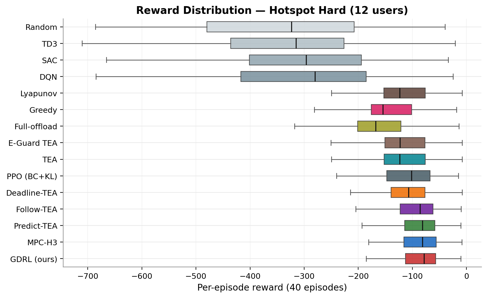
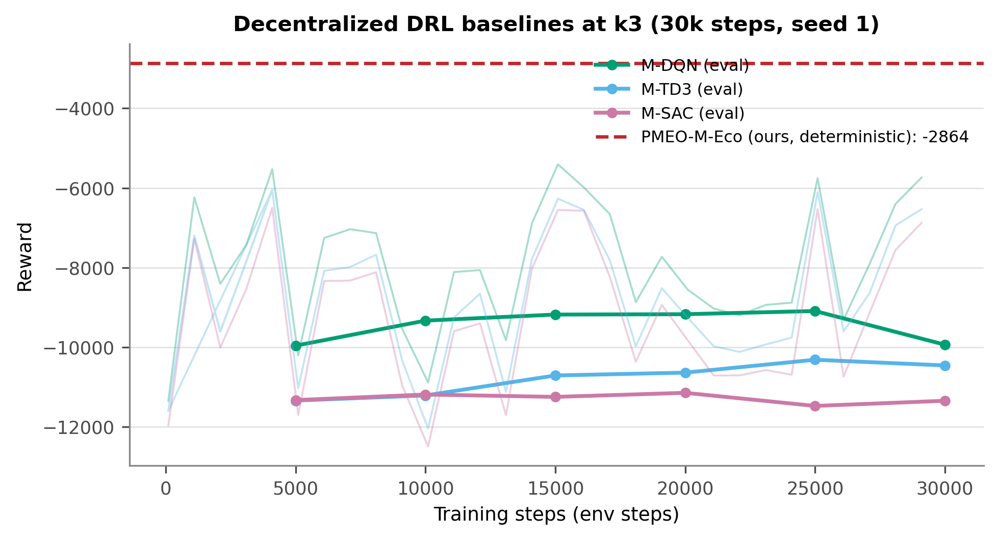
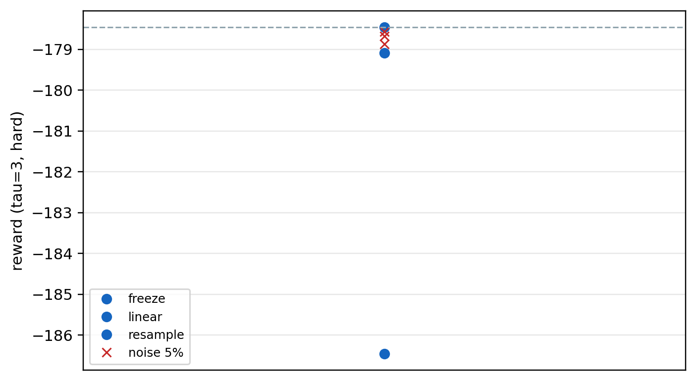
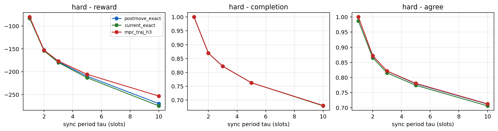

（2026-09-09 口径更新：内部汇报稿；措辞已被“状态相位错配 + 结构化短视界 + AoI/事件触发刷新”取代，DRL 定位为参考基线。见 `pmeo_laets_upgrade_status.md`。）
# 导师详细汇报稿（明天用）：三条线对比 + 毕设主线建议 + 口述脚本

> 用途：2026-09-08 与导师详细汇报。可打印带去，按时间轴讲。  
> 建议主线：**PMEO + LAETS**（`uav_leo_experiment` + `digital_twin_uav_leo`）  
> 备选/另投：`disaster_va_dag_ho`（VA-DAG-HO v2，已 Go IoT-J）  
> Reward 口径（主线 A）：负代价，**代数值越大越好**。

---

# 〇、开场 90 秒（先请老师定调）

老师您好。今天想系统汇报三块代码/方向，并请您拍板**毕业论文主线**。

我们仓库里其实是：

1. **`uav_leo_experiment`**：车联网 UAV–LEO 仿真器 + 轨迹/卸载算法实验床（PMEO 长在这里）  
2. **`digital_twin_uav_leo`**：在同一仿真器上加数字孪生与同步策略（LAETS）  
3. **`disaster_va_dag_ho`**：另一条独立题目——灾后硬覆盖 + 依赖任务 DAG + 可见窗嵌入调度  

**我的建议：** 毕设主线用 **1+2（PMEO+LAETS）**——已有详细初稿和汇报提纲，因果链完整。  
**第 3 条**做成可投 IoT-J 的独立工作，或毕设展望/附录；除非您希望整本换成灾后故事。

请您听完后帮我定：主线 A 还是换 B？B 是另投还是附录？

---

# 一、三条线对照表（2 分钟）

| | A1 `uav_leo_experiment` | A2 `digital_twin_uav_leo` | B `disaster_va_dag_ho` |
|--|--|--|--|
| 场景 | 车联网道路 + 移动热点 | 同左 + 孪生副本 | 灾后走廊，硬覆盖失联 |
| 用户/UAV | 单机 12–16；多机 ~51 / 3 UAV | 同左 | 40 终端 / 3 UAV / 2 LEO |
| 任务 | 独立比特包 + 部分卸载比例 | 同左 | **DAG 依赖应用**（采集→检测→融合→决策） |
| LEO | 经 UAV 中继，常值回传容量 | 同左 | **可见窗开关**；窗外不可用 |
| 覆盖 | 软连接（远=慢，不断） | 同左 | **硬圆盘 R=800 m**，圈外 assignment=-1 |
| 主方法 | **PMEO**：专家飞 + 移动后精确卸 | **LAETS**：负载触发同步 | **VA-DAG-HO**：固定巡逻 + 嵌入 ScheduleDAG |
| 是否学飞 | 启发式飞，不学 | 决策器复用 PMEO | **明确不学飞** |
| 创新抓手 | 决策顺序（先飞后卸） | 孪生新鲜度 + 事件同步 | 硬覆盖 + 窗剪枝 + DAG 嵌入 |
| 成熟度 | 很高，论文主战场 | 已并入双贡献 | 实验 Go IoT-J，章节未写 |
| 写作资产 | `thesis_draft_pmeo_laets.md` | 同一稿第 4 章 | SPEC / PUBLISH_P1 / REPRODUCE |

**一句话关系：**  
A1 是物理世界与 PMEO；A2 是「决策若跑在孪生上，何时刷新」；B 是另一篇故事，不要和 A 的「决策顺序」混成同一个创新点。

---

# 二、主线 A 详细讲解（重点 12–15 分钟）

## 2.1 我们在解决什么问题

车联网里，车上算力不够，任务可以：

1. 本地算  
2. 甩给附近 UAV  
3. 经 UAV 中继上 LEO  

UAV 还要飞：飞到哪，信道变；飞得猛，耗电。所以每个 1 秒时隙要同时定：

- UAV 位移（连续 2D，不是上下左右四键）  
- 每个用户：卸到哪 + 卸载比例（网格 0/0.25/…/1）  

常见路线：DRL（训练贵、可解释弱）或 MPC（前瞻重）。我们盯住一个常被忽略的点：

> **同一时隙必须先让 UAV 飞到新位置，再在新位置上算卸载代价。**  
> 若还在旧位置上「最优卸载」，等于用错信道，决策变差。

这就是 **PMEO（Post-Move Exact Offloading）**。  
若决策读的是数字孪生，状态旧了，这个顺序收益会被淹没 → 需要 **LAETS**。

**给老师的一句话：**  
不是再堆更复杂神经网络，而是把「决策顺序」和「孪生何时刷新」做对。

## 2.2 系统怎么建模（老师爱问细节）

- **实体：** 车辆用户 $U$、UAV $K$、LEO $L$、移动热点 $M$  
- **主实验规模：** 单机 hard $U=12$ / stress $U=16$；多机 $K=3$，约 51 用户，$2\times 2$ km  
- **热点：** 沿道路动，每时隙更新；热点附近任务密，外面仍有稀疏到达（不是全世界挤一点）  
- **信道：** LoS/NLoS 混合 + 香农；**无硬覆盖圆**——远了变慢，不是断连  
- **上星：** 用户**不能直连 LEO**，必须 UAV 中继：$r=\min(r_{u,k}, r_{k,\ell})$，回传约 20 Mbps  
- **时延：** 本地 / 传输 / 排队 / 远端计算；并行取 max；超截止期记丢弃  
- **能耗：** 任务功耗 + 飞行（悬停 + $v^3$ 项）  
- **统一标尺：**  
  $R_t = -L_t - w_e E_t - \lambda D_t$（默认 $w_e=0.001,\lambda=4$）  
  **所有算法同一环境、同一 reward**，越大越好（负得越少越好）

## 2.3 创新点 1：PMEO / PMEO-M-Eco（怎么算的）

每个时隙：

1. **观测**用户/热点/UAV/队列  
2. **专家轨迹：** 任务加权质心与「热点一步预测」各 50% 混合，速度裁剪后飞到 $\mathbf{p}_t$  
3. **移动后精确卸载：** 在 $\mathbf{p}_t$（不是 $\mathbf{p}_{t-1}$）上枚举  
   $\{\mathrm{local},\mathrm{UAV},\mathrm{LEO}\}\times\{0,0.25,0.5,0.75,1\}$（单机约 15 格），选代价最小  
4. 环境执行，结算 $R_t$  
**零训练**，复杂度约 $O(U\times 15)$

**关键消融（机制证据）：**  
轨迹完全相同，只把卸载从「移动后」改成「移动前」（Current-pos）：

| 场景 | post-move vs current | 检验 |
|------|----------------------|------|
| hard 40 集 | reward +2.5 | 37/40，p&lt;0.0001 |
| stress 40 集 | +4.0 | 37/40，p&lt;0.0001 |
| 200 集 | +2.6 / +2.9 | p 极小 |

无热点均匀到达时增益缩小 → 说明收益来自「移动量大 + 信道距离敏感」，不是调参幻觉。

**多机 PMEO-M-Eco：**

- 关联：移动后速率 + 每机负载上限  
- 轨迹：每机看自己用户质心 + 近热点  
- Eco：每机在小候选（原地/专家全速/半速/纯质心…）上短前瞻 H=3，含飞行能耗打分  

## 2.4 对比结果怎么讲（诚实口径）

**汇报顺序建议：** 多机硬结果 → 单机 → 顺序消融 → LAETS

**单机：**

- 相对 PPO / GAT / Transformer / DQN 等 DRL：**明显更好 + 零训练**  
- 相对短视界 MPC-H3/H10：**约 98%–99%**，有时略逊；H=30 反而差  
- **不要说「26 个方法全面第一」**  
- GDRL（Cai 等的图强化学习，可学习残差版，仅作训练对照、非本文方法）≈ PMEO → 说明「顺序做对」比再学一点残差更关键  

**多机：**

- PMEO-M-Eco 在 reward 与能耗上 **优于 MPC-M-H3**  
- 对去中心化 DQN/TD3/SAC：**约 3 倍以上优势**（按初稿口径）  

**算力账（老师常问「为何不用 MPC」）：**

- PMEO-M-Eco ~11 ms/时隙，零训练  
- MPC-M-H3 ~17 ms/时隙，多机还略差  
- DRL 推理可能快，但要训很久且结果差  
- **诚实边界：** $w_e$ 很大、极重节能时，单机 MPC 可能更省电——主声称放在综合时延/成功率/多机与部署成本  

**配图（按上面讲述顺序：多机 → 单机 → 算力 → 顺序消融；全部为已冻结实验输出，打印按路径取高清原图）：**

**配图 1 · 多机主结果（`fig1_k3_comparison.png`）：** 2×2 四面板——(a) reward、(b) 成功率、(c) 平均时延、(d) 总能耗；红 = PMEO-M-Eco（ours），其余为 MPC-M-H3 / PMEO-M / Current-pos / Follow-TEA / Random 与去中心化 M-DQN / M-TD3 / M-SAC。**参数：** 3 UAV / 51 用户 / 3 热点 / 2 km，10 seeds × 10 episodes；误差棒 = 跨 seed 标准差；星号 = 相对 ours 的 seed 对齐配对 t 检验（* p<0.05、** p<0.01、*** p<0.001）。**怎么讲 30 s：** 先指 ours 在 (a)(b) 最高、(d) 能耗与 MPC 相当且低于 PMEO-M；再指三个 DRL 柱 reward 低 3 倍以上——补一句「它们已训 30k 步，我们是零训练」。

**配图 2 · 规模扫描（`fig2_scale_sweep.png`，多机备选，讲 20 s）：** 三个面板 = UAV 数 K=2/3/4、用户数 30/50/80、部署面积 1/1.5/2/3 km 下的 reward 对比；红线 PMEO-M-Eco 在 9 个规模点上全部位于蓝线 MPC-M-H3 上方或持平。**参数：** 10 seeds × 10 episodes，其余同 k3 主实验。**怎么讲：** 应对「是不是挑了个好规模点」——「规模三个方向都扫了，没挑点」。

**配图 3 · 单机主对比（`reward_boxplot_hard.png`）：** 每个方法 40 集（每集一个点）的 reward 箱线分布，越靠右越好；PMEO / GDRL / MPC-H3 / MPC-H10 挤在最顶部且分布最窄，GAT-PPO、Transformer-PPO、PPO、DQN、SAC、TD3 等 DRL 与 TEA 系列整体更低、散布更大。**参数：** hotspot-hard 12 用户、30 时隙、40 集 seed 对齐；stress（16 用户）同版图 `reward_boxplot_stress.png` 结论一致。**怎么讲：** 强调「不是单点均值胜出，是整条分布最右且最窄；靠决策顺序做对，不靠训练」。

**配图 4 · 训练成本（`fig5_convergence.png`，配合「算力账」）：** 多机去中心化 DRL（M-DQN / M-TD3 / M-SAC）训练 30k env steps 的 eval reward 曲线（淡色 = 训练期曲线），红色虚线 = PMEO-M-Eco 免训练水平线。**参数：** k3 环境，DRL 各取 seed 1。**怎么讲 20 s：** 「训满 30k 步 eval 仍明显低于虚线（约 3 倍差距），还没算调参与重跑；我们确定性算法零训练、每时隙约 11 ms」。

**配图 5 · 决策顺序消融的可视化（`scale_decision_order.png`，对应 2.3 消融表）：** 横轴部署面积 1→3 km，柱高 = post-move reward − current reward（同轨迹只改求值位置），全部为正且随面积增大，柱上标 t 值。**参数：** 10 seeds 配对，p<0.0001。**怎么讲：** 「顺序收益不是调参幻觉——规模越大、UAV 移动越远，'在新位置算卸载'越关键」。

---

## 2.5 创新点 2：LAETS（数字孪生）

代码在 `digital_twin_uav_leo/`，决策器**复用 PMEO**，只改输入状态是否陈旧。

**设定：**

- 物理世界 = 原仿真器  
- 孪生每 $\tau$ 同步一次；间隙内外推（冻结/线性等）  
- UAV 位置用物理真值（自定位）；用户/热点/任务用孪生  

**核心发现：**

1. **同步放宽 → 性能崩**  
   单机 hard：$\tau=1$ reward ≈ -81；$\tau=10$ ≈ -270（约 3.3 倍恶化）  
   决策一致率：$\tau=1$ 为 1.0；$\tau=10$ 约 0.62  

2. **瓶颈在任务/负载建模，不在位置预测**  
   位置线性外推 vs 冻结几乎无差；盲目重采样任务反而更差  

3. **孪生陈旧会淹没 PMEO 的顺序收益**  
   $\tau=10$ 时 PMEO / current / MPC 趋同 →  
   **因果链：孪生新鲜 → 状态准 → 决策顺序收益才站得住**

4. **LAETS = 负载感知事件触发同步**  
   - i.i.d. 到达：自适应 ≈ 最优固定周期（免调 $\tau$）  
   - **突发流量**：负载触发在「同步次数—reward」上**支配**固定周期前沿  
   - **随机突发**（孪生不知道突发何时来）：优势仍成立  

**跟老师怎么说：**  
第二项贡献不是「又一个孪生框架」，而是证明**新鲜度是 PMEO 生效的前提**，并给出突发下免预知时刻的同步策略。

**配图（孪生实验，按上面「核心发现 1→4」顺序指；完整图注见 `digital_twin_uav_leo/results/figure_captions.md`）：**

**配图 A · τ 权衡（`fig_combined_k3_tau.png`，对应发现 1）：** 左 = k3 多 UAV、右 = 单 UAV；横轴同步周期 τ=1→10 时隙，纵轴 reward（越大越好）；蓝 = 普通 i.i.d.，红 = 固定窗口突发，橙 = 随机窗口突发（孪生不知相位）。**参数：** 决策器 = 孪生上的 PMEO（post-move）；单 UAV 40 集 / k3 5 seeds×10 集；突发配置 `burst_cycle=15、burst_on=3、到达率×4、任务尺寸×2`。**怎么讲 30 s：** 「同步从每 1 时隙放到 10 时隙，性能明显下降——k3 约 2 倍、单 UAV 约 3.3 倍（与上面文字一致）；红/橙线整体低于蓝线且更陡——任务忽多忽少时，孪生旧了的代价最大」。

**配图 B · 预测模型消融（`fig_predictor_robustness.png`，对应发现 2）：** 四种孪生外推的 reward 对比——freeze / linear / resample / linear+位置噪声 5–20%，灰虚线 = 该 τ 下的最好参考。**参数：** 单 UAV hard、τ=3、40 集。**怎么讲：** 「freeze 与 linear 几乎没差、位置噪声加到 20% 也几乎不动；反而是按错误分布重采样任务掉一截——瓶颈在任务/负载建模，不在位置预测」。

**配图 C · 顺序收益被淹没（`fig_tau_tradeoff_hard.png`，对应发现 3）：** 单 UAV hard 三面板 = reward / 完成率 / 决策一致率 vs τ；蓝 = PMEO（post-move）、绿 = current、红 = MPC-H3。**参数：** 12 用户、30 时隙、40 集，τ∈{1,2,3,5,10}。**怎么讲：** 指左面板——τ=1 时 post-move 与 current 差约 2.5，τ=10 三线收拢（差 <20）；「因果链的图证据：孪生不新鲜，把顺序做对也没用」；最右面板一致率从 1.0 掉到约 0.62，解释性能为什么崩。

**配图 D · LAETS 支配固定周期（`fig_combined_k3_adaptive.png`，对应发现 4）：** 左/右两面板 = 突发窗口固定 / 随机；横轴 = 每集平均同步次数（越少越好），纵轴 = reward；蓝线 = 固定周期 τ=1..10 的「花钱买质量」前沿，红方块 = 负载感知触发（标注 δ=25–50 m），黄三角 = 逐用户触发（对照）。**参数：** k3（51 用户 / 3 UAV），5 seeds×10 集。**怎么讲 30 s：** 「红方块基本都在蓝线上方——同样的同步次数拿到更高 reward；右面板孪生不知道突发何时来，支配关系依然成立；黄三角在最右边——逐用户比较浪费同步」。

**配图 E · 触发时机诊断（`fig_sync_timing_burst.png`，最直观的一张，可选）：** 一集示例（seed=73），蓝柱 = 每时隙活跃任务数（两个峰 = 两波突发），红三角 = 系统触发同步的时隙，浅红底纹 = 突发窗口。**参数：** 单 UAV 突发流量。**怎么讲 20 s：** 「红三角几乎都压在突发窗口 4–7、19–22 的起止处——'该刷才刷'，不是黑箱」。

---

## 2.6 主线 A 的仓库与文档地图

| 用途 | 路径 |
|------|------|
| 仿真与 PMEO/MPC/DRL | `docs/GDRL/uav_leo_experiment/` |
| 孪生与 LAETS | `docs/GDRL/digital_twin_uav_leo/` |
| 导师通俗提纲 | `docs/GDRL/docs/mentor_briefing_pmeo_laets.md` |
| 毕设详细初稿 | `docs/GDRL/docs/thesis_draft_pmeo_laets.md` |
| 论文图 | `docs/GDRL/experiments/uav_leo_v2x_paper_final/figures/` |
| 孪生论文图 | `docs/GDRL/digital_twin_uav_leo/results/`（fig_combined_k3_tau / fig_combined_k3_adaptive / fig_sync_timing_burst；图注见 figure_captions.md） |

**章节建议：**  
第 2 章模型 → 第 3 章 PMEO → 第 4 章 LAETS → 第 5 章结论；展望可点到灾后 DAG 线。

---

# 三、备选线 B：VA-DAG-HO（4–5 分钟，报清楚）

> 口径提醒：B 线指标是**成功率**，与 A 线 reward 不是同一把尺；讲 3.3 表格前先说明一句，避免导师混着比。

## 3.1 为什么另开一条

主线 A 是车联网软连接 + 独立任务包。我们还做了**灾后**设定：基站失效、硬覆盖、救援应用有依赖（DAG）、卫星有可见窗。这是独立可投稿工作，**创新点刻意不跟 PMEO「先飞后卸」、LAETS「同步触发」撞车**。

## 3.2 现在定稿口径（v2）

- **不学轨迹**：UAV 用固定 **T-patrol**（条带巡逻）  
- **硬覆盖** R=800 m：圈外 `assignment=-1`，约 **25%** 时隙连不上  
- **任务：** 应用 = DAG；非齐次热点到达  
- **主方法：** 巡逻 + 硬覆盖关联 + ScheduleDAG（可见窗剪枝 + DAG 序）  
- **投稿状态：** P1-lite **Go（IoT-J / 中等会议）**；`main_v2.yaml` 冻结  

## 3.3 和谁比（中心格，10 seeds）

| 方法 | 成功率 | 怎么讲 |
|------|--------|--------|
| Ours | **0.736** | 主方法 |
| hover | 0.641 | 本文 **+0.095，p=0.001** |
| chase | 0.729 | **≈打平**（承认；chase 要实时积压信息） |
| B4-flat（同轨迹只学卸） | 0.606 | 本文 **+0.131，p=0.001** |
| B6 无窗剪枝 | 成功率≈打平 | 时延多 **+0.17 s，p=0.014** |

额外：

- B4 训到 500 ep 无质变 → 不是「没训完」  
- 去掉 DAG 序：成功率虚高 0.82，但每完成 app 约 **3.3 次**「前驱未完成就提交」→ **假成功**  
- 去掉硬覆盖：成功率升到 0.87 且无人失联 → 证明硬覆盖改变问题  

## 3.4 若老师问「为什么不学飞」

v1 软连接时 random 已约 0.9，学飞没头寸。v2 加难后，贡献改成**覆盖与窗约束下的嵌入调度**；轨迹用巡逻贴合灾后搜索，不把「学飞」当主创新。chase 对照证明：**换成追热点飞，嵌入仍大幅优于扁平 RL**。

## 3.5 B 线文档

- `disaster_va_dag_ho/SPEC_V2_DS.md`  
- `disaster_va_dag_ho/PUBLISH_P1.md`  
- `disaster_va_dag_ho/REPRODUCE.md` §7  

---

# 四、我请老师拍板的三件事

1. **毕设主线：**  
   - □ A：PMEO + LAETS（推荐）  
   - □ B：VA-DAG-HO 整本换题  
   - □ A 为主 + B 作扩展章/另投  

2. **投稿节奏：** 主线 A 先投哪里？B 是否单独投 IoT-J？  

3. **近期优先级：**  
   - 若定 A：补齐初稿图表与 Related Work，准备开题/中期材料  
   - 若定 B：补机制图 + 收敛曲线，开写 B 的章节  

---

# 五、老师可能追问 · 预案（务必过一遍）

### Q1：创新是不是太「工程细节」？决策顺序算创新吗？

**答：** 文献大量联合轨迹与卸载，但很少**单独验证**「卸载按移动前还是移动后位置求值」。我们有命题式直觉 + 配对消融（同轨迹只改求值位置）+ 统计显著；并证明孪生陈旧时该收益消失——不是调参噪声。

### Q2：为什么不用更强的 DRL / 端到端大模型？

**答：** 车联网边缘要冷启动、可解释、可复现。同环境下 DRL 训完仍明显差；多机差一个数量级。GDRL 残差 ≈ PMEO，说明瓶颈在机制而非网络容量。

### Q3：单机都逼近 MPC 了，PMEO 还有意义吗？

**答：** 单机接近短视界 MPC（98%–99%）但零训练、更轻；多机 Eco **打过** MPC-H3；部署上避免长视界采样噪声。诚实承认重节能权重下 MPC 可能更省电。

### Q4：数字孪生是不是套概念？

**答：** 我们量化了 $\tau$ 与性能、一致率；指出任务建模比位置预测关键；突发下负载触发相对固定周期有硬优势，且不依赖预知突发时刻。与 PMEO 绑成因果链，不是单独贴标签。

### Q5：三条线会不会题目散？

**答：** 建议毕设只钉 A；B 独立故事（灾后/DAG/硬覆盖/可见窗），另投或展望。仓库里三文件夹是工程隔离，不是三个毕设。

### Q6：B 线 chase 都差不多，创新站得住吗？

**答：** 主贡献是嵌入调度相对扁平 RL（+13 点显著）和窗剪枝降时延，不是「发明最强飞法」。巡逻的理由是少先验、符合搜救流程；chase-mover 下 embed≫flat 仍成立。

### Q7：用户能直连卫星吗？为什么没有云？

**答（A）：** 模型假设偏远/车联网经 UAV 中继上星，无直连、无稳定地面云——与 SAGIN 边缘设定一致。  
**答（B）：** 灾后骨干中断，同样无直连云；可选扩展已写在规格，本轮不做以免冲淡主矛盾。

### Q8：代码可复现吗？

**答：** A 有固定修复版环境口径与论文图目录；B 有 `REPRODUCE.md`、config hash 记账、45 单测、P1 敏感性与 Wilcoxon。

---

# 六、推荐口述时间轴（约 25 分钟 + 讨论）

| 时间 | 内容 |
|------|------|
| 0:00–1:30 | 开场：三条线 + 请老师定主线 |
| 1:30–3:30 | 对照表：A1/A2/B 差异 |
| 3:30–8:00 | A 场景与建模 |
| 8:00–14:00 | PMEO 方法 + 消融 + 单机/多机结果 |
| 14:00–18:00 | LAETS 因果链 + 突发结果 |
| 18:00–22:00 | B 线 v2 结果与 Go 状态 |
| 22:00–25:00 | 拍板三问 + 下一步 |
| 其后 | 答疑（用第五节预案） |

**超时预案：** 老师中途提问多时，优先砍 ①2.2 后半（建模细节口头压成「与通俗版同口径，细节可会后看文档」）②3.3 的「额外」三条；仍不够就把 B 线整段收成 2 分钟，只报中心格一行。若砍了 B，记得把省下的时间留给「拍板三问」，那才是本次会议要拿到的结果。

---

# 七、结束时递交的「一页纸建议」

**建议决议：**

1. 毕业论文题目方向：**面向车联网的 UAV-LEO 三层 MEC：决策顺序敏感卸载（PMEO）与负载感知孪生同步（LAETS）**  
2. 工程底座：`uav_leo_experiment`；孪生章：`digital_twin_uav_leo`  
3. `disaster_va_dag_ho`：**独立投稿（IoT-J）** 或毕设第 5 章展望，不与 PMEO 抢「决策顺序」贡献  
4. 近两周：按老师选择推进初稿完善 / 或 B 线补图开写  

---

# 八、随身口令（紧张时看这 5 句）

1. **主线 A：** 先飞后卸 + 孪生要够鲜，免训练打过 DRL，多机打过短视界 MPC。  
2. **因果链：** 孪生新鲜 → 状态准 → 顺序收益。  
3. **诚实：** 单机≈MPC 不是全面碾压；重节能时 MPC 可能更省电。  
4. **备选 B：** 灾后硬覆盖 + DAG + 窗剪枝；不学飞；显著优于悬停与扁平 RL。  
5. **请老师定：** 毕设钉 A 还是换 B；B 另投还是附录。
