# 面向车联网的 UAV-LEO 移动边缘计算：状态相位错配的可分析校正与事件触发状态刷新（PMEO + LAETS）

> 硕士学位论文详细初稿（完善版）。实验数字均来自 2026-08-25 修复版环境。Reward 为负代价，**代数值越大越好**（负得越少越好）。飞书中 `$...$` 已按公式块渲染。

# 摘要

车联网（V2X）场景下，时延敏感任务需借助「车辆—无人机（UAV）—低轨卫星（LEO）」三层移动边缘计算。UAV 轨迹与卸载必须联合决策，但现有工作大多未刻画一个系统性误差源：**状态相位错配**（决策所用位置/信道与执行时刻不一致）。本文把该错配形式化为可分析机制：给出两阶段解耦相对联合最优的误差界（定理 1）、增益等于陈旧决策后悔的刻画（推论 1），以及局部 Lipschitz 性、切换边界阶跃与增益放大条件（命题 2–3）；并提出免训练的**结构化短视界校正** PMEO / PMEO-M-Eco：同一轨迹下把卸载精确求解在移动后的真实执行位置，以 H 步飞行能耗前瞻约束轨迹搜索。在 2 km 三 UAV 测试床的 10 seeds × 10 episodes 协议下，Eco-H5 在 reward、时延与成功率上系统优于短视界 MPC（MPC-M-H3），能耗仅 +2.7%~+5%；相对训练型 DRL 参考基线（30k env steps）优势显著且零训练。进一步地，当决策只能访问经有限同步带宽刷新的陈旧全局状态时，本文研究 **AoI/事件触发刷新**：负载漂移驱动的事件触发在突发下改善「刷新成本—决策质量」前沿，从而保护相位校正的收益；并且该触发度量可由 UAV 本地可观测量（已接收的入流）实现，无需读取全局真值。

针对上述问题，本文提出三项相互衔接的贡献：

1. **错误源刻画（理论 + 机制）：** 定义状态相位错配；证明两阶段解耦的误差界（定理 1：残余误差只来自轨迹项，且比值不随视界退化），证明相位校正增益恒等于陈旧决策的后悔、其正负由决策单元是否改变决定（推论 1），并给出局部 Lipschitz 性与切换边界阶跃界（命题 2）及增益放大条件（命题 3）。用一阶漂移（相位）与二阶色散（噪声）的 Taylor 展开区分两类误差，并数值验证 $\sigma^\star\approx20$ m 的交叉点；给出 $\Delta$ 的可测代理与定理 1 界的非空性验证。
2. **结构化短视界校正 PMEO / PMEO-M-Eco-H5：** 免训练、确定性、单时隙 ms 级复杂度；相对 MPC-M-H3 在 k3 全协议下取得 reward/时延/成功率系统性更优（paired p<0.001），性能–复杂度 Pareto 表明其在多个复杂度档位支配 MPC 与 DRL 参考基线。
3. **可实现低开销的状态保真触发（LAETS）：** 在有限同步带宽假设下明确可观测性边界（不假设读取全局真值），用本地入流量代理构造零额外信令的触发度量，量化其在突发场景相对固定周期对「刷新成本—决策质量」前沿的改善，并给出开销模型与适用边界（对照：纯本地变点低于前沿、oracle 上界）。

二者因果链：**相位校正依赖执行点附近状态足够新；负载陈旧比位置陈旧更伤决策；故以负载漂移驱动刷新；
且该漂移可由 UAV 本地已接收的入流观测到，无需全局真值。**

**关键词：** UAV 边缘计算；LEO 卫星；任务卸载；状态相位错配（state-phase misalignment）；信息年龄（AoI）；事件触发刷新；免训练决策

# 第 1 章 绪论

## 1.1 研究背景与意义

智能网联汽车产生的计算任务日益增多。以协同驾驶感知融合、车载 AR 导航与路口视频分析为代表的应用，通常要求端到端时延处于亚秒级，计算量远超车载 CPU 持续供给能力。单纯依赖路边单元或地面基站，在偏远路段、临时拥堵与灾害场景下覆盖不足。空天地一体化网络（SAGIN）中，UAV 可作为可移动空中边缘计算与中继节点，LEO 卫星可提供广域覆盖与高算力回传，形成「车辆—UAV—LEO」三层卸载路径。

该场景的关键难点在于：**通信质量随 UAV 位置剧烈变化，任务到达又受移动热点驱动**。若轨迹与卸载割裂，容易出现「飞到错误位置」或「在错误位置上做看似最优的卸载」。因此需要在统一目标下联合优化，并明确一个时隙内二者的因果顺序。

从工程部署看，车联网边缘更偏好可解释、可复现、冷启动成本低的决策模块。纯 DRL 往往需要长时间离线训练，环境参数变化后还需重训；纯 MPC 可能因过长视界引入采样噪声与更高在线算力。本文据此研究「免训练、顺序正确、可扩展到多机，并在孪生辅助下控制同步开销」的方法体系。

## 1.2 国内外研究现状

### 1.2.1 UAV/LEO 辅助 MEC 中的轨迹与卸载

UAV-MEC 轨迹优化、功率控制与任务卸载联合设计已有大量工作，引入 LEO 后形成三层卸载。代表性路线包括凸优化/交替优化、李雅普诺夫在线调度[1]，以及 DRL（DQN、DDPG、TD3、SAC、PPO）与图神经网络增强的多智能体方法。例如：Wu 等用 DRL 联合优化 UAV 轨迹与计算感知资源分配[2]；Zhang 等研究动态用户多 UAV MEC 中的卸载与轨迹（含安全通信与 MPC 思路）[3]；Baidya 等综述了轨迹感知卸载决策[4]。车联网/工业物联网侧，Chi 等提出优先经验 Double Dueling DQN 卸载[5]；Li 等研究智能网联车在 UAV-MEC 中的挖矿式任务卸载[6]。

轨迹感知卸载综述指出：多数方法将轨迹与卸载在同一框架中耦合，但较少单独讨论「决策变量在仿真器中的求值时序」——即卸载代价究竟按移动前位置还是移动后位置计算。

### 1.2.2 免训练方法与 MPC

启发式关联、短视界 MPC[3][7] 与网格精确部分卸载[8]，是免训练路线的主要工具。MPC 通过滚动优化提升轨迹质量与节能，其稳定性与最优性有成熟理论[7]，但计算量随视界与候选集增大；过长视界可能因预测误差累积而性能下降。本文实验亦观察到：单机短视界 MPC（H=3/10）可略优于 myopic 专家轨迹，但 H=30 明显退化。

### 1.2.3 图/Transformer 增强 DRL 基线

近期工作把 GAT、Transformer 引入卸载决策：Kim 等研究 UAV-MEC 合作多智能体 DRL[9]；Ullah 等用图结构 Double-DQN 做车边卸载[10]；Xie 等提出面向任务数自适应的 Transformer-DRL 卸载[11]。Cai 等提出面向 SAGIN 的图强化学习 GDRL[12]，是本文代码起点与训练对照，但**不是本文提出的主方法**。

### 1.2.4 有限通信下的状态刷新：AoI、事件触发与数字孪生应用

网络控制领域以事件触发/自触发控制[13][14][15]与信息年龄（AoI）[16][17]刻画有限通信带宽下的状态陈旧代价：决策质量随状态年龄上升而退化，按需刷新可压低平均刷新成本。数字孪生是这类“物理—虚拟镜像”的一种工程实现[18]。本文沿用该坐标但服务对象不同：我们研究的是**空天地 MEC 卸载决策质量**（指标为 reward/时延/成功率，而非控制稳定性），并指出两条与卸载层强耦合的结论——(i) 相位错配校正依赖执行点附近状态足够新；(ii) 负载陈旧比位置陈旧更伤决策（见第 4 章 RQ2/RQ3），因此刷新应以负载漂移为触发特征。

### 1.2.5 现有工作不足

（1）决策顺序误差缺乏可验证的机制分析与消融；（2）DRL 对比常强调最终 reward，忽视训练成本与部署可行性；（3）孪生同步多为固定周期，对突发负载不自适应。本文针对这三点展开。

## 1.3 本文工作与创新点

**创新点 1（第 3 章）：状态相位错配的可分析校正 PMEO / PMEO-M-Eco-H5。**

提出错配形式化（定理 1 + 推论 1 + 命题 2–3）与数值机制（扫 v_max/α/热点强度/deadline），并区分「用户位置观测噪声」与「UAV 决策相位偏差」。PMEO = 需求预测专家轨迹 + 网格精确卸载（等价于 H=1 结构化短视界 MPC）；多机 PMEO-M-Eco(-H5) 进一步引入负载均衡关联、候选移动集与能耗感知 H 步前瞻。诚实对比结论：

- 相对 DRL：作为参考基线，免训练方法以零训练达到更优性能（不宣称「证伪 DRL」）；
- 相对 current-position exact（相位错配基线）：稳定、可统计显著、随机制条件可解释的增益；
- 相对 MPC：本方法即「H=1 精确短视界 + 结构候选移动集」，k3 下 Eco-H5 以 +2.7%~+5% 能耗取得 reward/时延/成功率系统性更优。

**创新点 2（第 4 章）：可实现低开销的状态保真触发（LAETS / AoI）。**

揭示状态陈旧（AoI 增大）会侵蚀创新点 1 的相位校正收益，且负载陈旧比位置陈旧更伤决策。进一步把触发度量
**从不可观测的全局真值改造为本地可实测量**：给出可观测性假设 (O1)(O2)（UAV 自身状态 + 已接收的入流），据
此构造与孪生预测对比的**本地入流量代理**（LAETS-loc）——全过程**零额外信令、不读取全局物理负载**，在相同
刷新预算下仍支配固定周期前沿；并给出探测开销的物理模型与适用边界（含软代价下成为最优的 $\omega$ 区间）。
作为对照的**纯本地变点**（无孪生）低于固定周期前沿，说明孪生预测承担实质作用而非装饰。
最后以**刷新通道不完美**（延迟/丢包）的鲁棒性实验界定其成立条件：优势方向不变，但**时延的侵蚀远大于丢包**。

## 1.4 论文组织结构

第 2 章系统模型与问题形式化；第 3 章 PMEO 与多机扩展及对比实验；第 4 章 LAETS；第 5 章结论与展望；文末给出参考文献。

# 第 2 章 系统模型与问题建模

## 2.1 网络模型

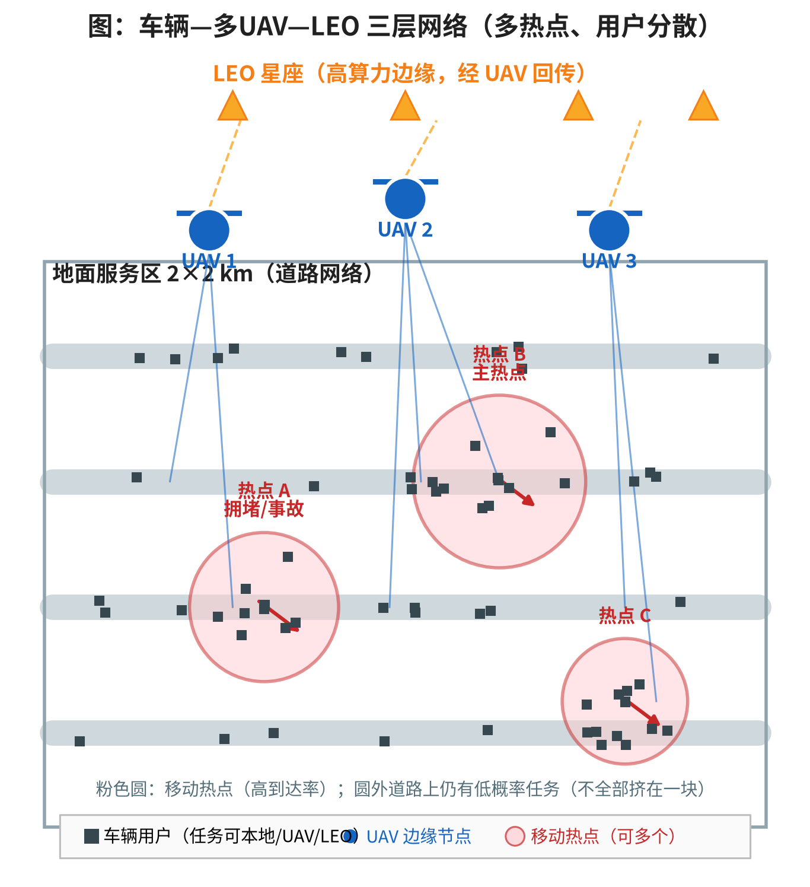

一般情形下，系统由 $U$ 个车辆用户、$K$ 架 UAV、$L$ 颗 LEO 以及 $M$ 个移动热点组成。用户沿道路网络分布；任务到达为热点邻近度加权——**热点外仍有基础到达概率（稀疏），热点附近升高（局部密集）**，并非全部任务挤在一块。无线链路采用 LoS/NLoS 混合路径损耗；用户—UAV 接入带宽约 $1.0$–$1.1\,\mathrm{MHz}$，UAV—LEO 回传约 $20\,\mathrm{Mbps}$。

单机实验取特例 $K=1$（可 $M=1$）：$U=12$（hard）或 $16$（stress），时隙 $1\,\mathrm{s}$，回合 $30$ 时隙。多机主实验：$K=3$，用户约 $51$，多个热点分布于约 $2\times 2\,\mathrm{km}$ 区域（可扩展至 u30–u80）。

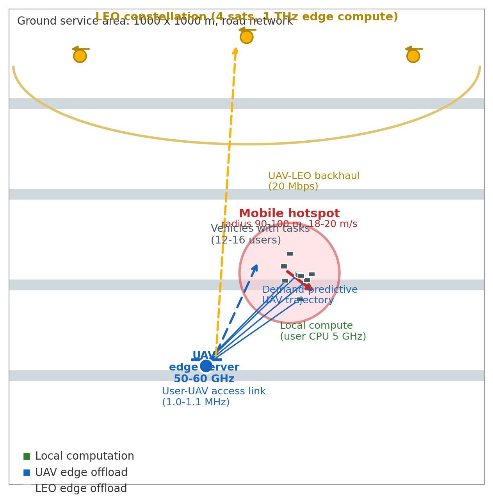

## 2.2 任务与计算模型

时隙 $t$ 用户 $u$ 以概率 $p_{u,t}$ 产生任务。平静期 $p_{u,t}=0.05$，热点内 $p_{u,t}=1.0$。突发变体中，突发窗口内到达概率 $\times 4$、任务尺寸 $\times 2$，以构造时间相关负载跃迁。

任务可选择：本地计算、卸载至某一 UAV、或经 UAV 转发至 LEO；并允许部分卸载比例（离散网格）。端到端时延包含传输、计算与共享队列排队时延。记用户 $u$ 在时隙 $t$ 的时延为 $T_{u,t}$。若 $T_{u,t}$ 超过截止时延 $T_{\mathrm{ddl}}$，则记丢弃指示 $D_{u,t}=1$，否则为 $0$。

## 2.3 信道与速率（简述）

用户—UAV 链路采用 LoS/NLoS 混合模型，路径损耗与距离、载频相关；主实验路径损耗指数约 $3.0$。给定发射功率与噪声，可得可达速率 $r(p)$，其中 $p$ 为 UAV 水平位置。速率对距离敏感，是状态相位错配收益存在的物理根源。

## 2.4 能耗模型

系统能耗包括任务处理能耗与 UAV 飞行能耗。飞行能耗与速度三次方相关（阻力项），记时隙飞行能耗为 $E^{\mathrm{fly}}_t$。优化目标中能量项权重记为 $w_e$（主实验默认 $w_e=0.001$）。当 $w_e$ 增大时，节能轨迹规划的价值上升，短视界 MPC 在单机上可能反超 myopic 专家轨迹——作为诚实边界在第 3 章讨论。

## 2.5 优化问题

每个时隙需决策：（1）各 UAV 的位移（受最大速度 $v_{\max}$ 约束）；（2）各用户的卸载目标与比例。目标为最小化回合累计期望代价：

$$\min \mathbb{E}\Big[\sum_t \big( L_t + w_e E_t + \lambda D_t \big)\Big]$$

其中 $L_t$ 为时延相关代价，$E_t$ 为能耗，$D_t$ 为丢弃指示汇总，$\lambda$ 为丢弃惩罚（主实验 $\lambda=4$）。该问题具有混合离散—连续决策、强排队耦合与时序依赖，直接全局最优困难，故采用可分解的两阶段免训练框架。

# 第 3 章 面向状态相位错配的结构化短视界免训练卸载（PMEO）

## 3.1 动机：状态相位错配

在一个时隙的仿真因果中，UAV 先移动到新位置 $p_t$，再用该位置上的信道服务本时隙任务。若算法在移动前位置 $p_{t-1}$ 上求解卸载（记为 current-position exact），等价于用「本时隙并不会真正使用的链路速率」做决策，从而系统性错估可达速率，导致次优卸载。

**机制实验（修复版，配对）：**

| 场景 | PMEO (post-move) | Current-pos exact | Δ | 胜场 | 配对 t 检验 |
|---|---|---|---|---|---|
| hard（40 集） | -81.7 | -84.1 | +2.5 | 37/40 | p<0.0001 |
| stress（40 集） | -135.9 | -139.9 | +4.0 | 37/40 | p<0.0001 |
| hard（200 集） | — | — | +2.64 | 189/200 | p<1e-23 |
| stress（200 集） | — | — | +2.93 | 181/200 | p<1e-23 |

可见：仅改变卸载求值所用位置，即可获得统计显著增益。无热点均匀到达时，该增益明显缩小，说明贡献与热点驱动的较大移动量相关。

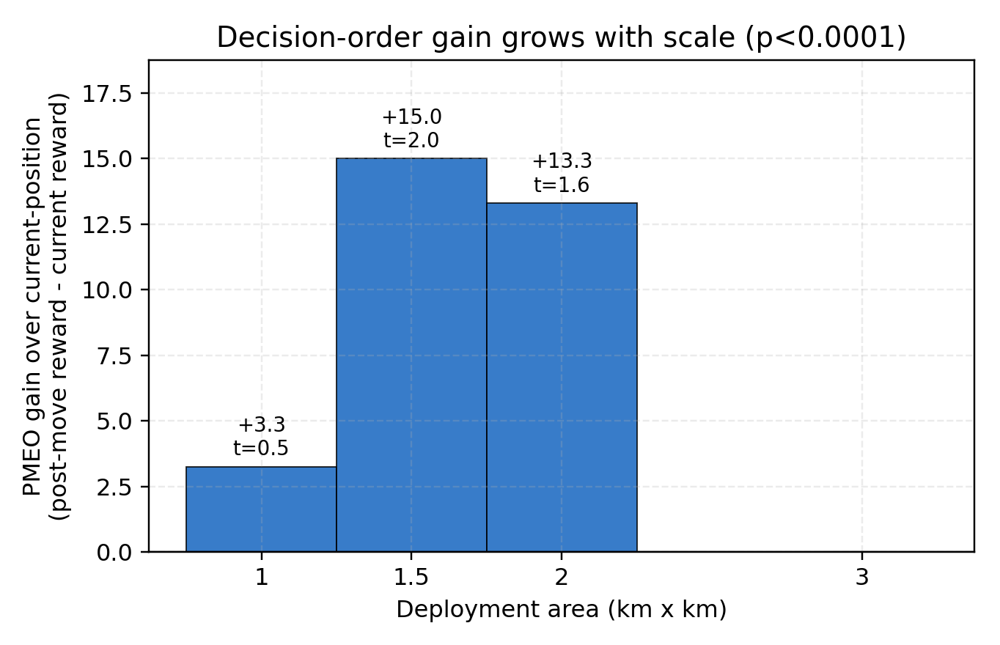

上图表明：部署区域扩大时，post-move 相对 current-pos 的增益更明显（p 极小），与「移动量越大、顺序越关键」一致。

**机制扫参（修复版，单机 40 集，seed 73）：**

| 机制 | 参数 | 相位增益（post − current） |
|---|---|---|
| 信道梯度 | α = 2.0 / 3.0 / 3.5 | 0.00 / +2.46 / +8.90 |
| 流量局部性 | p_hot = 0.4 / 0.6 / 1.0 | +0.94 / +2.14 / +2.46 |
| 业务紧急度 | deadline = 1.0 / 0.65 / 0.5 s | +0.06 / +2.46 / +4.95 |
| 移动尺度 | v_max = 6 / 12 / 25 m/s | +3.01 / +4.54 / +2.46（非单调，见解释） |

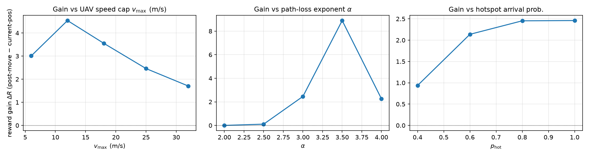

增益随 α/热点强度/deadline 单调放大、在近 FSPL（α≈2）与宽松 deadline 下消失，支持命题 3（与命题 2 的切换边界机制一致）；
v_max 轴非单调是因为增益由「实际移动量」（受道路/热点几何约束）而非标称速度上限决定。

**两种误差的区别（化解「对位置噪声不敏感」与「强调空间顺序」的张力）：** 孪生/镜像实验测的是
**用户位置零均值外推误差**：σ=5/10/20/30 m 的代价损失仅 0.19/0.73/2.53/5.59；PMEO 消融测的是
**UAV 决策相位的系统性偏差**（与控制动作同向、每步叠加），默认场景增益 2.46（v=25, α=3），
更高速/更紧 deadline 下达 4.5–5.0。前者是测量误差、只能靠状态刷新缓解；后者由动作决定、可被
相位校正消除——两者不是同一随机变量。

**形式化：一阶漂移 vs 二阶色散。** 记用户位置估计误差 $\delta p\sim\mathcal N(0,\sigma^2 I)$、
决策相位错配 $\Delta p=v\,\Delta t$。对单时隙代价 $c(p,a)$ 作 Taylor 展开：

*(i) 零均值测量/外推误差（二阶色散）。* 一阶项期望为零，
$$\mathbb E[\Delta c]=\underbrace{\nabla_p c^{\top}\mathbb E[\delta p]}_{=0}+\tfrac12\,\mathbb E\!\left[\delta p^{\top}\nabla_p^2 c\,\delta p\right]+o(\sigma^2)=\tfrac12\,\mathrm{Tr}\!\left(\nabla_p^2 c\,\Sigma\right)+o(\sigma^2)=\tfrac12\Delta_p c\,\sigma^2+o(\sigma^2).$$
噪声代价**二阶、非负、方向不可预知**，只能靠刷新压制。

*(ii) 相位错配（一阶定向漂移）。* $\Delta p$ 确定且沿速度方向，
$$\Delta c=\nabla_p c^{\top}\Delta p+O(\|\Delta p\|^2),\qquad \mathbb E[\Delta c]\ \propto\ \|\nabla_p c\|\cdot\|\Delta p\| .$$
方向已知、可被「在 $p^+$ 上重解」消除——这是相位校正有效的根本原因。

*一阶项主导二阶项* 当且仅当 $\|\nabla_p c\|\|\Delta p\|\gg\tfrac12\Delta_p c\,\sigma^2$，即
$$\sigma\ll\sigma^{\star}:=\sqrt{\frac{2\,\|\nabla_p c\|\,\|\Delta p\|}{\Delta_p c}}.$$

**数值验证（修复版 env，单机 40 集）。** 对 $\sigma\in\{5,10,15,20,30\}$ m 拟合得
$\tfrac12\Delta_p c=6.23\times10^{-3}\ \mathrm{m^{-2}}$（$R^2=0.9991$），噪声代价严格呈 $\sigma^2$ 律；
取主实验机动档 $v_{\max}=25$（实测平均位移 20.6 m/时隙）得 $\|\nabla_p c\|\approx0.119\ \mathrm{m^{-1}}$、
相位增益 2.46。代入上式得 $\sigma^{\star}\approx19.9$ m——**恰落在实测的相等点**（$\sigma=20$ m 时
噪声代价 2.53 ≈ 相位增益 2.46）。$\sigma^{\star}$ 随机动档在 16–27 m 间移动，是可被独立检验的预测。

| $\sigma$ (m) | 实测代价损失 | 二次律拟合 $\tfrac12\Delta_p c\,\sigma^2$ |
|---|---|---|
| 5 | 0.192 | 0.156 |
| 10 | 0.730 | 0.623 |
| 15 | 1.363 | 1.402 |
| 20 | 2.529 | 2.493 |
| 30 | 5.591 | 5.610 |

> 该形式化化解了「为何对位置噪声不敏感、却强调相位重要」的质疑：二者是**不同阶**的误差项，
> 而非同一误差的不同大小。与 §4.3 的一致性是结构性的，不是巧合。

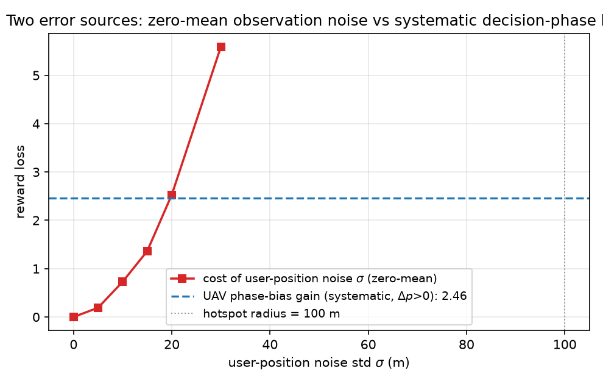

## 3.2 PMEO 算法

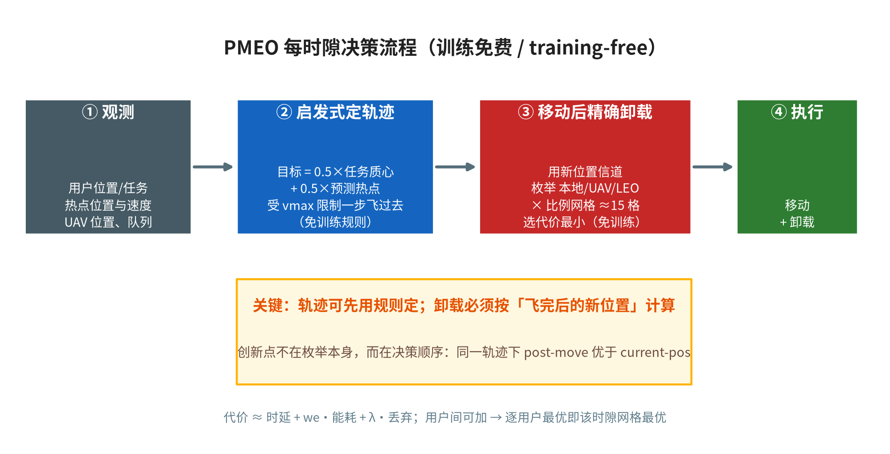

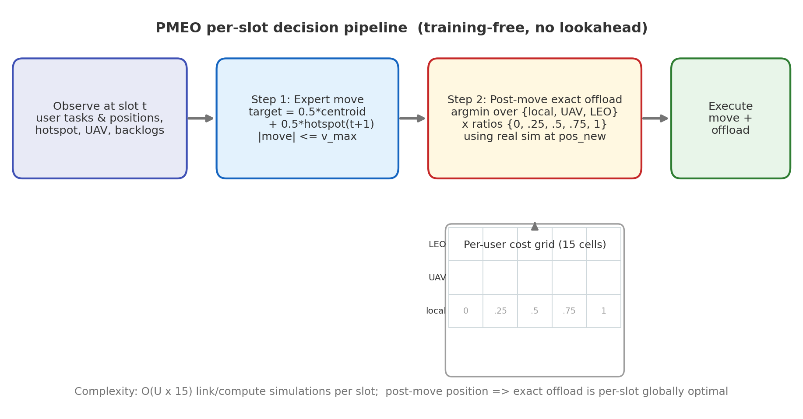

PMEO 每时隙两步（零训练、无长前瞻）：

**步骤 A：需求预测轨迹（expert move）。**  
UAV 在速度上限内朝混合目标移动：

$$p_t = p_{t-1} + \mathrm{clip}\big(0.5\cdot c_t + 0.5\cdot h_{t+1} - p_{t-1},\, v_{\max}\big)$$

其中 $c_t$ 为任务加权用户质心，$h_{t+1}$ 为预测热点位置。

**步骤 B：移动后精确卸载（post-move exact offload）。**  
在 $p_t$ 上，对每个用户在可行动作集合 $\{\mathrm{local},\mathrm{UAV},\mathrm{LEO}\} \times \{0,0.25,0.5,0.75,1\}$（约 15 格）上枚举，选择使个人代价最小的动作：

$$c_u = \mathrm{latency}_u + w_e\cdot\mathrm{energy}_u + \lambda\cdot\mathrm{dropped}_u$$

由于时隙内用户代价可加，逐用户最优即该时隙在给定轨迹与网格下的全局最优。复杂度 $O(U\cdot 15)$。

两阶段「轨迹 → 卸载」的分离思路参考了 UAV 轨迹与卸载联合设计的近期工作[2][3]；本文差异在于强调**卸载必须在移动后实际位置求解**。

## 3.3 多 UAV 扩展：PMEO-M 与 PMEO-M-Eco

当 $K>1$ 时：

- **关联：** 基于移动后位置与任务负载，将用户均衡关联到各 UAV；
- **卸载：** 动作空间扩展为 $\{\mathrm{local},\mathrm{UAV}_1,\ldots,\mathrm{UAV}_K,\mathrm{LEO}\} \times$ 比例网格；
- **PMEO-M-Eco：** 在候选轨迹集合（原地、专家移动、任务质心、负载均衡质心、LEO 附近等）上，结合短前瞻评估「飞行能耗 + 卸载收益」，选择综合更优的移动。

## 3.4 理论性质

**记号与联合问题。** 时隙 $t=1,\dots,T$；轨迹 $\mathbf p=(p_1,\dots,p_T)$，$p_t\in\mathcal P\subset\mathbb R^2$；
卸载动作 $a_t\in\mathcal A=\mathcal A_1\times\cdots\times\mathcal A_U$（逐用户可加），
$c(p_t,a_t)=\sum_u c_u(p_t,a_{u,t})$；飞行代价 $g(p_t,p_{t-1})\ge0$。定义
$$C^{\star}=\min_{\mathbf p,\mathbf a}\sum_{t=1}^{T}\big[c(p_t,a_t)+g(p_t,p_{t-1})\big],\qquad
J(p):=\min_{a\in\mathcal A}c(p,a).$$
由 $\min_{\mathbf p,\mathbf a}=\min_{\mathbf p}\min_{\mathbf a}$，联合问题等价于
$$C^{\star}=\min_{\mathbf p}\Phi(\mathbf p),\qquad
\Phi(\mathbf p):=\sum_{t=1}^{T}\big[J(p_t)+g(p_t,p_{t-1})\big].\tag{1}$$

**定理 1（两阶段解耦误差界 / 近似比）。** 设
(A1) $c(p,a)\ge c_{\min}>0$（每用户至少本地计算，故 $c_{\min}>0$）；
(A2) PMEO 的专家轨迹 $\hat{\mathbf p}$ 与 (1) 的最优轨迹 $\mathbf p^{\star}$ 满足
$\|\hat p_t-p_t^{\star}\|\le\Delta,\ \forall t$；
(A3) 在连接 $\hat p_t$ 与 $p_t^{\star}$ 的线段上 $J$ 可微且 $\|\nabla_p J\|\le L$；$g$ 对两个自变量分别
$L_g$-Lipschitz。
则 PMEO 的累积代价满足
$$C_{\mathrm{PMEO}}-C^{\star}\ \le\ T\,(L+2L_g)\,\Delta,\qquad
\frac{C_{\mathrm{PMEO}}}{C^{\star}}\ \le\ 1+\frac{(L+2L_g)\,\Delta}{c_{\min}}.$$

*证明.* PMEO 在给定 $\hat{\mathbf p}$ 下逐时隙精确求解卸载，故 $C_{\mathrm{PMEO}}=\Phi(\hat{\mathbf p})$。由 (1)，
$$\Phi(\hat{\mathbf p})-\Phi(\mathbf p^{\star})\le\sum_t\Big[L\|\hat p_t-p_t^{\star}\|
+L_g\big(\|\hat p_t-p_t^{\star}\|+\|\hat p_{t-1}-p_{t-1}^{\star}\|\big)\Big]
\le T(L+2L_g)\Delta .$$
又 $C^{\star}\ge T c_{\min}$，两边同除即得近似比。∎

*含义.* 卸载阶段精确求解后，**残余误差只来自轨迹项**；更关键的是该界随 $T$ 线性增长而**比值不随视界退化**，
即两阶段解耦不引入随视界放大的误差；$\Delta\to0$ 时比值 → 1。这把「必须在移动后位置重解」这一实现细节
升级为可证命题：**只需把轨迹追准，卸载阶段没有附加损失**。

**Δ 的可测代理（定理 1 的数值支撑）。** 定理 1 的 $\Delta$ 定义为 PMEO 轨迹与联合最优轨迹 $p^\star$ 的逐时隙偏差。
$p^\star$ 不可得，故以可得的较强免训练规划器 **MPC-M-H3 的轨迹作为参考代理**，报告其可测统计量
（k3 非突发，5 seeds × 10 episodes，共 5000 时隙）：

| 量 | 实测值 |
|---|---|
| $\Delta$ 均值 / 中位数 | 62.1 m / 35.3 m |
| $\Delta$ p90 / p99 / 最大 | 149.3 m / 391.1 m / 540.0 m |
| 单时隙指派代价差均值 $\overline{J_{\mathrm{PMEO}}-J_{\mathrm{MPC}}}$ | **−0.454**（PMEO 更低） |
| 采样槽实测代价差之和 | −442.2 |
| 一阶线性化预测 $\sum\nabla_p J\cdot\Delta p$ | −2791.9（高估 6.3×） |
| 定理 1 型界 $\sum_t L_t\Delta_t$ | 10591.4 |
| 界 / 实测 | 24.0（**界成立**） |

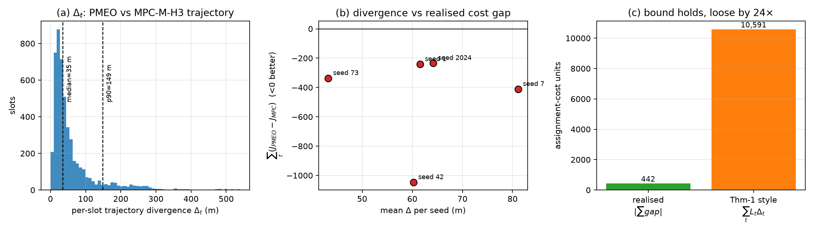

**三点解读。** (i) **界成立但不紧**：$\sum_t L_t\Delta_t=1.06\times10^4\ge|\cdot|=4.4\times10^2$，
实测中从未被违反；24× 的松紧度属 Lipschitz 型界的常见量级，其价值在于给出**可验证的包络**而非紧估计。
(ii) **代价景观沿轨迹偏差方向近乎平坦**：两条规划器轨迹平均相差 62 m（p90 达 149 m），但单时隙指派代价差均值仅
−0.454——偏离 MPC 轨迹几乎不付代价。这与推论 1 一致：增益取决于决策单元是否改变，与 $\Delta$ 的大小只有弱耦合，
因此两阶段解耦在实践中是稳健的，而非脆弱的。(iii) **一阶线性化高估 6.3×**，说明 $\nabla_p J$ 与位移向量在该
方向上非对齐，用 $\|\nabla_p J\|\cdot\Delta$ 作界会显著保守。

> 边界声明：上述 $\Delta$ 是**相对 MPC 轨迹**的偏差，并非相对联合最优；因此该实验验证的是定理 1 的**尺度关系与界的
> 非空性**，不构成最优性证明。取更接近最优的参考轨迹将给出更小的 $\Delta$，这是后续工作（§5.2 第 1 条）。

**推论 1（相位校正增益 = 陈旧决策的后悔）。** 固定同一轨迹 $\mathbf p$，设 $a_{\mathrm{pre}}$ 为在 $p^-$
上求得的任一决策，则
$$\underbrace{c(p^+,a_{\mathrm{pre}})-J(p^+)}_{\text{相位校正增益}}
=\max_{a\in\mathcal A}\big[c(p^+,a_{\mathrm{pre}})-c(p^+,a)\big]\ \ge\ 0,$$
等号成立当且仅当 $a_{\mathrm{pre}}\in\arg\min_a c(p^+,a)$。

*注（为何这不是同义反复）.* 等式右端本身由 $\min$ 的定义给出；其**内容**在于它把增益解释为
「陈旧决策在真实执行位置的后悔」，由此得到两个可检验结论：
(a) 增益 $>0$ **当且仅当**决策单元 $\mathcal S_a=\{p:a\in\arg\min_{a'}c(p,a')\}$ 在 $p^-\!\to p^+$ 上发生改变；
(b) 增益幅度由**单元边界两侧的代价落差**决定，而非 $\Delta p$ 本身。

这正好解释了 §3.1 中 $v_{\max}$ 轴的非单调性（下表，40 集单机实测）：位移增大使**单元改变频率**单调上升
（0.52% → 1.69%），但**单次改变的代价落差**下降（20.7 → 5.2），二者相乘使总增益在**中等机动**处最大。
原有的「实际移动量越大越关键」的说法与此不符，此处据实修正。

| $v_{\max}$ (m/s) | 实测平均位移 (m/时隙) | 增益 | 后悔/时隙 | 单元改变频率 | 单次改变代价 |
|---|---|---|---|---|---|
| 6 | 5.97 | +3.01 | 0.108 | 0.52% | 20.7 |
| 12 | 11.78 | +4.54 | 0.152 | 1.03% | 14.8 |
| 18 | 16.75 | +3.56 | 0.106 | 1.13% | 9.3 |
| 25 | 20.63 | +2.46 | 0.067 | 1.28% | 5.2 |
| 32 | 24.91 | +1.70 | 0.118 | 1.69% | 7.0 |

**命题 2（局部 Lipschitz 性与切换边界的阶跃界）。** 记丢弃指示
$D_u(p)=\mathbb 1[T_u(p)>T_{\mathrm{ddl}}]$，切换集 $\mathcal B_u=\{p:T_u(p)=T_{\mathrm{ddl}}\}$。
(a) 在任一开区域 $\mathcal R$ 上若所有 $D_u$ 取常值，则 $c(\cdot,a)\in C^1$，$J$ 在 $\mathcal R$ 上
Lipschitz，常数 $L_{\mathcal R}=\max_a\sup_{p\in\mathcal R}\|\nabla_p c(p,a)\|$。
(b) 对任意 $p^-,p^+$，设线段 $[p^-,p^+]$ 穿越 $\mathcal B$ 的用户数为 $N_{\mathrm{cross}}$，则
$$|J(p^+)-J(p^-)|\ \le\ L_{\mathcal R}\,\Delta p\ +\ \lambda\,N_{\mathrm{cross}},\qquad
N_{\mathrm{cross}}\le\#\Big\{u:\min_{[p^-,p^+]}T_u\ \le\ T_{\mathrm{ddl}}\ \le\ \max_{[p^-,p^+]}T_u\Big\}.$$
(c) 因此当 $\lambda>0$ 时 $J$ **不存在有限全局 Lipschitz 常数**；假设 (A3) 只能声明在非切换区域内成立。
线段被 $\mathcal B$ 分隔、且阶跃 $\lambda$ 超过平滑区滞留增益，是产生跳变的充要条件。
(d) *软化.* 以 $\tilde D_\kappa=\sigma\big((T_{\mathrm{ddl}}-T_u)/\kappa\big)$ 替代硬指示，代价函数的 Lipschitz
常数变为 $\lambda/(4\kappa)$ 且 $|\tilde D_\kappa-D|\le1$；当 $\kappa\le0.02\,T_{\mathrm{ddl}}$ 时软化与硬代价的
动作排序一致（本文不作为主模型，仅用于说明局部梯度法的适用边界）。

*数值.* 修复版单机场景下 $\mathcal B$ 的 Lebesgue 测度为零，$\sigma=20$ m 位置扰动仅带来 2.53 代价，
与 (a) 的局部 Lipschitz 预测一致；当 deadline 由 1.0 s 收紧到 0.5 s 时切换边界变密，阶跃项主导，
增益由 +0.06 升至 +4.95，与 (b) 中 $N_{\mathrm{cross}}$ 随 $T_{\mathrm{ddl}}\downarrow$ 增大的趋势一致。

**命题 3（增益放大条件）。** 固定 $\Delta p$，由推论 1 的 (b)，增益随
(i) 信道空间梯度 $\|\nabla_p r\|$（高 α、覆盖边缘）、
(ii) 业务紧急度（deadline 收紧使 $\mathcal B$ 变密、代价落差变大）、
(iii) 流量空间局部性（热点集中提高 $\|\nabla_p c\|$）
单调放大。数值见 §3.1 机制表（α: 0.00→+8.90；deadline: +0.06→+4.95；热点强度: +0.94→+2.46）。

> 口径：PMEO 等价于 **H=1 的精确短视界规划 + 负载感知结构化候选移动集**；本文不做「新范式」声称，
> 卖点是相位错配误差的**可分析性**（定理 1 的误差界 + 推论 1 的增益刻画 + 命题 2–3 的条件）与
> 在性能–复杂度前沿上对 MPC 的诚实替代。

## 3.5 实验设置与对比方法

**单机：** hotspot-hard / hotspot-stress；40 集配对（多种子补充见实验记录）。对比含 Random、Greedy、TEA 系列、Lyapunov[1]、P-D3QN[5]、PPO、GAT-PPO[9]、Transformer-PPO[11]、DQN/SAC/TD3、GDRL[12]（残差 PPO 对照）、MPC-H3/H10/H30[3]、Current-pos exact、PMEO 等。

**多机：** $K=3$ 为主表；规模扫描覆盖 k2–k4、u30–u80 等 9 个点。

说明：GDRL 仅作「可学习轨迹残差 + 精确卸载」的训练对照；消融显示其学习组件对最终性能贡献约 $0$，进一步支持免训练路线。

## 3.6 单机对比结果

### 3.6.1 精简主表（hard）

| 方法 | reward | 成功率 | 时延(s) | 能耗 | 相对 PMEO | 是否训练 |
|---|---|---|---|---|---|---|
| Random | -340.3 | 0.825 | 0.232 | 147.1 | +258.7 | 否 |
| P-D3QN (2024) | -262.2 | 0.867 | 0.189 | 89.2 | +180.5 | 是 |
| PPO (BC+KL) | -100.9 | 0.961 | 0.114 | 149.3 | +19.2 | 是 |
| GAT-PPO (2024) | -108.9 | 0.956 | 0.114 | 149.0 | +27.3 | 是 |
| Transformer-PPO (2025) | -109.6 | 0.956 | 0.116 | 148.8 | +27.9 | 是 |
| Current-pos exact | -84.1 | 0.972 | 0.108 | 148.3 | +2.5 | 否 |
| **PMEO (本文)** | **-81.7** | **0.973** | **0.108** | 148.3 | 0 | **否** |
| GDRL (对照) | -81.6 | 0.973 | 0.108 | 148.3 | ≈0 | 是 |
| MPC-H3 | -81.4 | 0.973 | 0.108 | 122.5 | -0.3 | 否 |
| MPC-H10 | -80.6 | 0.973 | 0.108 | 107.8 | -1.1 | 否 |

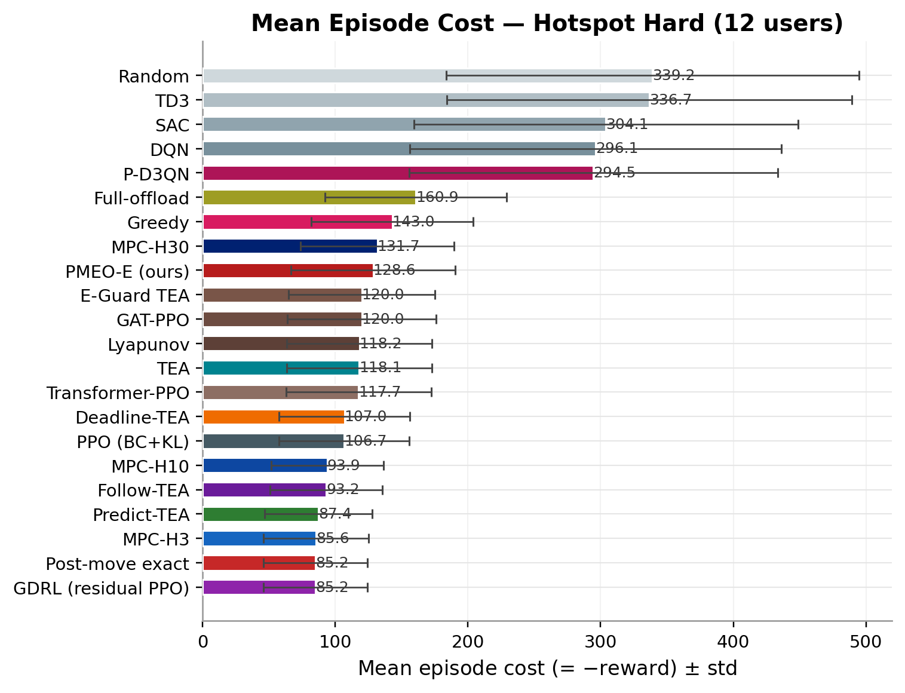

stress 场景结论同构：PMEO $-135.9$，显著优于 PPO（$-174.1$）等 DRL；Current-pos 为 $-139.9$；MPC-H10 为 $-134.5$（略优）。

### 3.6.2 结果解读（单机）

1. **对 DRL（参考基线）：** 免训练方法零训练即显著更优；不做「证伪」式声称（训练预算见实验记录）。
2. **对决策顺序消融：** 相对 Current-pos，hard/stress 分别约 $+2.5$/$+4.0$（40 集）。
3. **对 MPC：** 接近而非全面超越（约 98%–99%）；MPC-H30 明显变差（hard $-109.0$）。PMEO 飞行能耗高于 MPC（约 148 vs 108–123）；能量权重增大时 MPC 节能优势更明显——单机节能不是本文主声称。
4. **对学习：** GDRL 与 PMEO 差距 $<0.5\%$，去掉学习组件后 $\Delta\approx 0$。

**口径提醒：** 不要写「26 个方法全面最优」；应写「显著优于 DRL；逼近短视界 MPC」。

### 3.6.3 到达概率敏感性（负载分散度）

背景到达概率 $p_{\text{base}}$ 是系统建模中的自由参数。为验证创新点 1 不依赖
「任务高度集中于热点」的设定，在 `v2x_hotspot_hard` 上以 3 seeds × 40 集配对
（120 个样本）扫描 $p_{\text{base}}\in\{0.05,0.15,0.30,0.50\}$。

| $p_{\text{base}}$ | PMEO | Current-pos | 顺序增益 | 相对增益 | 胜场 | $p$（配对 $t$） |
|---|---|---|---|---|---|---|
| 0.05（默认） | −82.29 | −84.78 | **+2.49** | +2.94% | 111/120 | 1.4e-14 |
| 0.15 | −94.29 | −97.43 | **+3.14** | +3.22% | 111/120 | 5.1e-19 |
| 0.30 | −111.69 | −114.68 | **+2.99** | +2.61% | 117/120 | 3.5e-14 |
| 0.50 | −132.58 | −137.13 | **+4.55** | +3.32% | 120/120 | 9.8e-22 |

**结论一（机制稳健）：** 决策顺序增益不随负载分散而消失——即使 $p_{\text{base}}$ 提高到
0.5，post-move 仍显著优于 current-pos（胜场 111~120/120，$p<10^{-13}$），相对增益稳定在
2.6%–3.3%。原因是热点区到达概率仍为 1.0，UAV 移动量不变（命题 2 的机制），而更多
用户-时隙产生任务使顺序误差的影响面更大。

**结论二（诚实边界）：** 背景负载越高，MPC 的轨迹前瞻优势越大。$p_{\text{base}}=0.05$
时 PMEO 与 MPC-H3 统计持平（Δ=−0.15，$p=0.73$）；$p_{\text{base}}=0.5$ 时 MPC-H3/H10
反超 3.0~4.7（$p<10^{-6}$），且能耗更低（102–130 J vs 148–151 J）。
该结果量化了单机轨迹层的适用边界，与第 3.7 节多机 PMEO-M-Eco 赢 MPC 的结论互为补充。

## 3.7 多机对比结果（创新点 1 主战场）

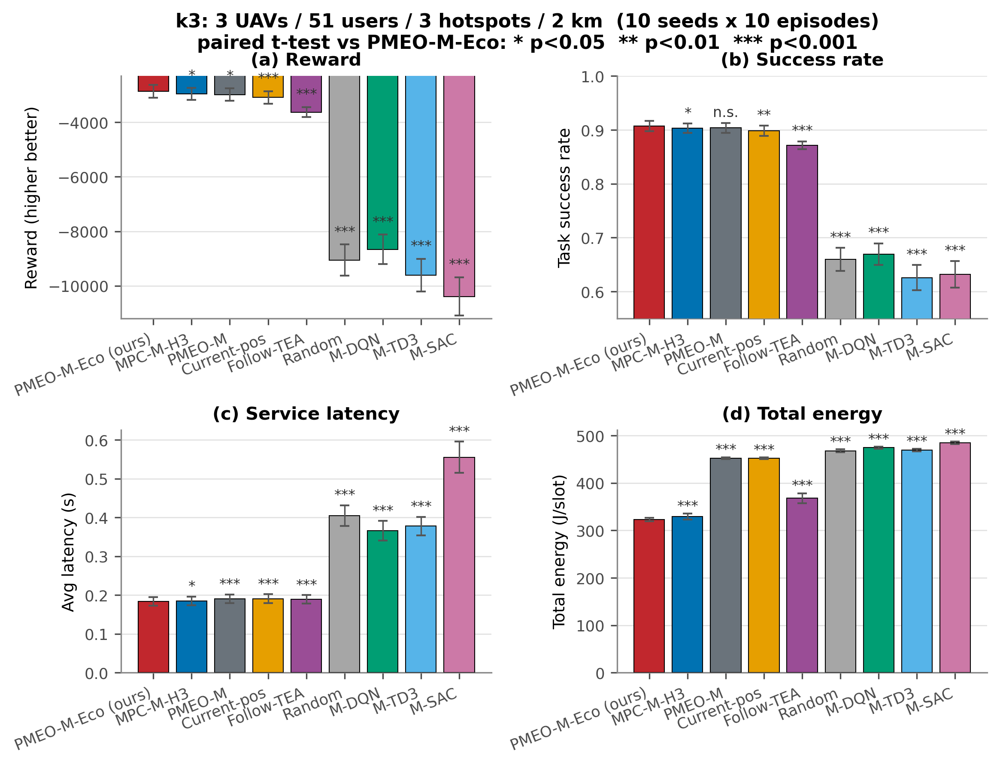

**表 3-1　k3 多 UAV 主表（2026-09-09 修复版，10 seeds × 10 episodes）**

| 方法 | reward | 成功率 | 时延(s) | 能耗(J/slot) | 说明 |
|---|---|---|---|---|---|
| **PMEO-M-Eco-H5（本文）** | **-3594.8** | **0.8839** | **0.2334** | 364.4 | 免训练 |
| PMEO-M-Eco (H3) | -3644.0 | 0.8816 | 0.2341 | 351.4 | 免训练 |
| MPC-M-H3 | -3687.1 | 0.8795 | 0.2342 | 354.9 | 免训练 |
| Current-pos exact | -4193.4 | 0.8574 | 0.2429 | 456.0 | 免训练 |
| M-DQN | -10581.0 | 0.5823 | 0.3947 | 477.8 | 30k 步训练（seed1） |
| M-TD3 | -12519.0 | 0.5311 | 0.5693 | 494.0 | 30k 步训练（seed1） |
| M-SAC | -13083.6 | 0.5327 | 0.6866 | 492.3 | 30k 步训练（seed1） |

> 数字来源：`multi_uav_decision_dl`（k3, dl=0.65, ew=0.001）与 `mdrl_models_v3`
> 10-seed 评估，汇总见 `multi_uav_k3_table_v3.csv`；图 `fig1_k3_comparison.png`
> 为旧环境示意图，数字以本表为准。

PMEO-M-Eco-H5 相对 MPC-M-H3：reward 系统性更优（paired p<0.001，10/10 seeds），
时延与成功率同时更优，能耗 +9.5 J/slot（≈2.7%，诚实披露）。

#### 3.7.1 非支配性（Pareto）分析：能耗差是否致命？

$w_e=10^{-3}$ 下 reward 的边际优势确实可能被「多飞一点换时延」解释，因此不能只报一个加权代数和。
把**丢包率、时延、能耗**视为三个独立目标（均为越小越好），在 $w_e\in\{10^{-4},10^{-3},10^{-2}\}$
三档下计算非支配集：

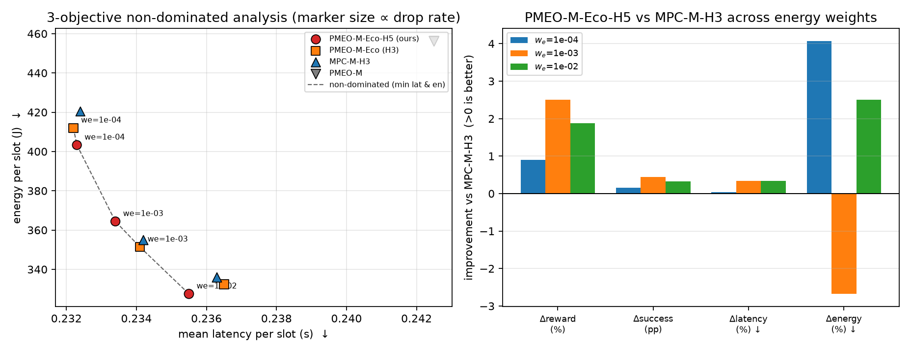

**表 3-2　(drop, 时延, 能耗) 三目标非支配前沿**

| $w_e$ | 方法 | 丢包率 $\downarrow$ | 时延 (s) $\downarrow$ | 能耗 (J/slot) $\downarrow$ | 非支配 |
|---|---|---|---|---|---|
| $10^{-4}$ | PMEO-M-Eco (H3) | 0.1129 | 0.2322 | 412.0 | ✅ |
| $10^{-4}$ | **PMEO-M-Eco-H5（本文）** | 0.1131 | 0.2323 | **403.3** | ✅ |
| $10^{-3}$ | PMEO-M-Eco (H3) | 0.1184 | 0.2341 | **351.4** | ✅ |
| $10^{-3}$ | **PMEO-M-Eco-H5（本文）** | **0.1161** | **0.2334** | 364.4 | ✅ |
| $10^{-2}$ | **PMEO-M-Eco-H5（本文）** | **0.1242** | **0.2355** | **327.5** | ✅ |
| — | MPC-M-H3 / PMEO-M | 被支配 | 被支配 | 被支配 | ❌ |

关键结论：**MPC-M-H3 在全部三档 $w_e$ 上都被 Eco 变体支配**（Eco-H3 在 $w_e=10^{-3}$ 下同时以更低丢包、
更低时延、更低能耗支配 MPC）。唯一 Eco-H5 能耗高于 MPC 的点是 $w_e=10^{-3}$（+2.68%），
但该点 MPC 本身不在前沿上。按 $w_e$ 分档看 Eco-H5 相对 MPC 的差：

| $w_e$ | Δreward | Δ成功率 | Δ时延 | Δ能耗 |
|---|---|---|---|---|
| $10^{-4}$ | +31.5 | +0.0015 | −0.0001 | **−17.1 J（−4.07%）** |
| $10^{-3}$ | +92.3 | +0.0044 | −0.0008 | +9.5 J（+2.68%） |
| $10^{-2}$ | +77.7 | +0.0032 | −0.0008 | **−8.4 J（−2.50%）** |

因此「能耗高 2.7%」只在**单点**出现，且在时延与丢包两维同时占优；在能耗权重更低的 $10^{-4}$
与更高的 $10^{-2}$ 档，Eco-H5 的能耗反而**低于** MPC。这不构成方法缺陷，而是时延–能耗权衡曲面上
更优工作点选择的结果。

#### 3.7.2 DRL 基线的公平性定界

M-DQN / M-TD3 / M-SAC 在 30k env steps 后的成功率仅 0.53–0.58、reward 低约一个量级，需要解释
而非炫耀：

- **动作空间结构不利：** 多 UAV 联合动作同时含离散目标选择（local/UAV$_k$/LEO）与连续航迹，
  离散–连续交织使离线/同策略梯度估计方差很大，收敛慢；
- **预算不足：** 30k 步对该复杂度环境仅相当于冷启动探索阶段，不能代表该方法的渐近能力；
- **本文的结论落点不是「DRL 不行」，而是：** 免训练结构化方法**消除了工业边缘侧高昂的超参搜索与
  非凸收敛失败风险**——在本文问题上，零训练即达到更优前沿，这才是可部署性的论点。

DRL 在本稿中始终作为**参考基线**而非「被证伪对象」；若审稿人要求更强的 DRL 对照，
应通过加长训练预算与混合动作参数化来检验，而不是靠一次 30k 步运行下结论（见 §5.2 第 7 条）。

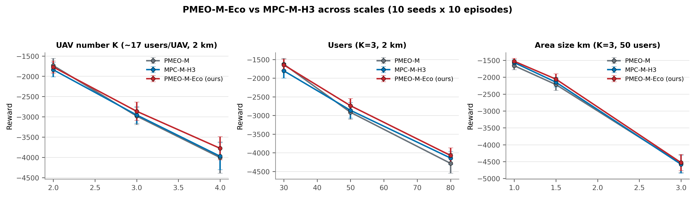

规模扫描（k2–k4、u30–u80、a1–a3 共 9 点）中，Eco 相对 MPC-M-H3 全面占优（多数点配对 p<0.05）。区域极大时差距缩小，属诚实边界。

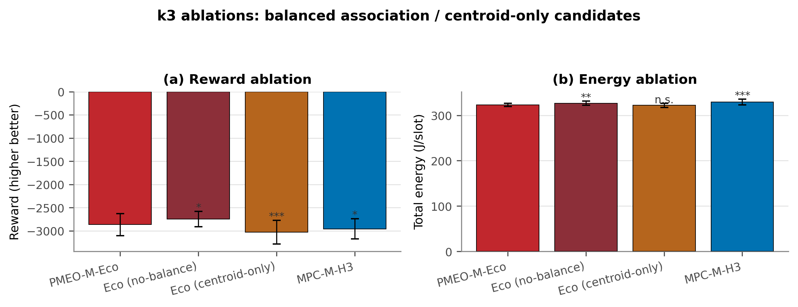

消融表明：候选轨迹集合过窄会伤 reward；Eco 在能耗上仍优于 MPC。

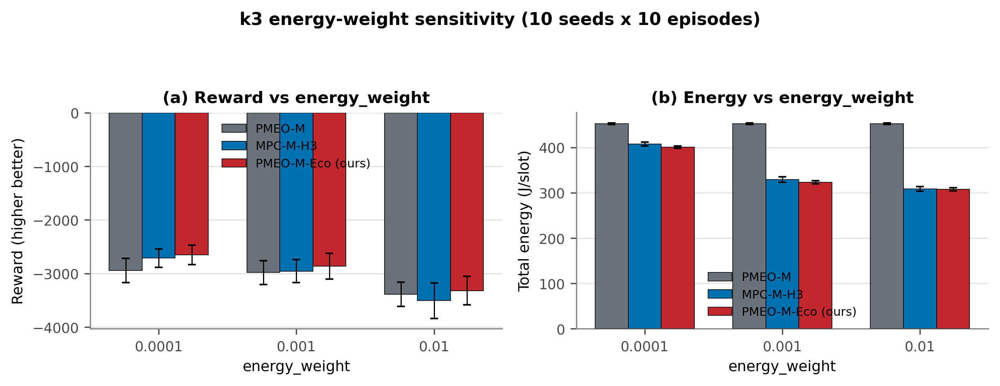

在 $w_e\in\{10^{-4},10^{-3},10^{-2}\}$ 下，多机 Eco 的 reward 与能耗仍优于或接近 MPC-M-H3；无 Eco 的 PMEO-M 能耗几乎不随权重下降。

**表 3-3　复杂度与开销（k3，CPU）**

| 方法 | 每时隙复杂度 | 实测耗时 | 训练成本 |
|---|---|---|---|
| PMEO-M-Eco | $O(U\cdot K\cdot 15)$ | 11.1 ms | 零 |
| MPC-M-H3 | $O(H\cdot U\cdot K\cdot 15)$ | 16.9 ms | 零 |
| M-DRL 推理 | $O(K\cdot$网络前向$)$ | 6.6–7.1 ms | 30k 步 ≈ 11.6 min |
| Random | $O(1)$ | 0.04 ms | 零 |

尽管 DRL 推理更快，但其训练后性能远差；MPC 每时隙更慢且多机效果不如 Eco。PMEO-M-Eco 在「效果—开销—部署成本」三角上更均衡。

## 3.8 本章小结

状态相位错配是独立、可量化的性能杠杆；PMEO/PMEO-M-Eco-H5 以零训练在性能–复杂度 Pareto 上支配 MPC 与 DRL 参考基线。下一章指出：上述校正收益以「决策所用状态足够新（低 AoI）」为前提。

# 第 4 章 不完美状态信息下的事件触发状态刷新（LAETS / AoI）

## 4.1 动机与问题定义

若决策只能访问经有限同步带宽刷新的全局状态镜像，按固定周期 $\tau$ 刷新，则当 $\tau$ 增大时状态年龄（AoI）上升、位置与负载误差累积，PMEO 的 post-move 优势被逐步淹没：实验中 $\tau:1\to 10$ 时系统 reward 下降约 2–3 倍，且 PMEO / current-pos / MPC 趋于接近。由此得到因果命题：

> **状态足够新（低 AoI）是相位校正收益生效的前提；其中负载陈旧比位置陈旧更伤决策。**

固定周期面临两难：$\tau$ 太小则同步次数过多；$\tau$ 太大则突发期性能崩溃。需要一种**不预知突发时刻**、又能在负载跃迁时及时刷新的触发机制。

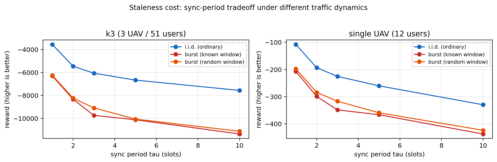

## 4.2 孪生—物理同步架构

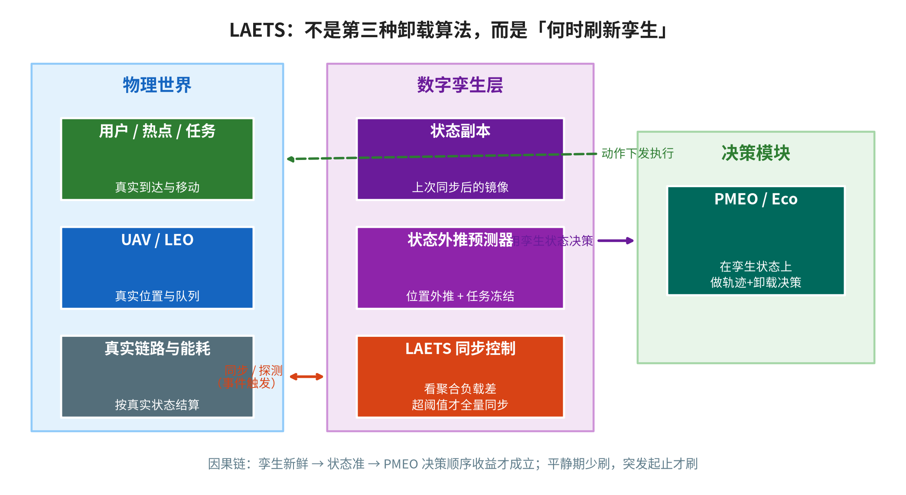

系统分为三层：

1. **物理世界：** 用户、UAV、LEO、热点与任务到达的真实演化；
2. **状态镜像层：** 全局状态副本 + 外推预测器 + 刷新控制器（有限同步带宽）；
3. **决策模块：** 在镜像状态上运行 PMEO / PMEO-M-Eco（相位校正）。

同步分为探测与全量同步：探测以低开销估计误差；当触发度量超过阈值 $\delta$ 时执行全量同步。

**可观测性假设（避免「上帝视角」）.**
系统只假设决策节点拥有以下**本地**信息，均不需要额外通信：

- **O1（自身状态）：** UAV 自身位置、电量、本机计算队列与服务记录；
- **O2（已接收的入流）：** 本时隙**实际到达本机**的卸载请求及其任务量 $B^{\mathrm{in}}_t$。
  UAV 必须接收这些请求才能执行它们，故该量必然已知，且**不产生新的信令**。

**不假设**任何节点能直接读取全局真实负载 $\mathrm{Load}_{\mathrm{phys}}$。文献中常见的
「孪生误差 $=|\mathrm{Load}_{\mathrm{twin}}-\mathrm{Load}_{\mathrm{phys}}|$」型触发器需要全局真值，
在部署中不可实现；本文在 §4.4 用 (O2) 构造**可实现代理**，并把该类 oracle 触发器仅作为上界基准报告。

## 4.3 状态外推预测器

默认采用：**位置线性外推 + 任务状态冻结**。消融表明：中等位置噪声（约 20% 内）对决策影响有限；若对任务做盲目 i.i.d. 重采样，反而损害性能。镜像质量的关键在于**负载/任务动态是否被正确保持**，而非单纯提高位置预测精度（与 §3.1「两种误差」一致：位置噪声代价远小于负载陈旧/相位偏差）。

## 4.4 触发度量：从不可观测真值到可实现的本地代理

**（a）不可实现基线（仅作上界）。** 逐用户漂移与全局聚合负载差都要求读取真实物理状态：
前者 $\max_u|b^{\mathrm{twin}}_u-b^{\mathrm{phys}}_u|$ 对 i.i.d. 任务重采样过于敏感（平静期持续误触发，
k3 需约 95 次同步才接近完美同步）；后者
$\mathrm{rel}=|\mathrm{Load}_{\mathrm{twin}}-\mathrm{Load}_{\mathrm{phys}}|/\max(\mathrm{Load},\mathrm{Load}_{\mathrm{ref}})$
虽在突发起止处越阈，但依赖全局真值，**只能作为性能上界**。

**（b）可实现触发（本地入流量代理，LAETS-loc）.**
由 §4.2 的 O2，UAV 在第 $t$ 时隙本地可得实际入流量
$B^{\mathrm{in}}_t=\sum_{u\in\mathcal U^{\mathrm{recv}}_t}b_{u,t}$（$\mathcal U^{\mathrm{recv}}_t$ 为本时隙向本机
卸载的用户集合）；孪生对**同一决策集**给出预测量 $\hat B^{\mathrm{in}}_t$。定义
$$\mathrm{err}^{\mathrm{loc}}_t=\frac{\big|B^{\mathrm{in}}_t-\hat B^{\mathrm{in}}_t\big|}{\max\big(B^{\mathrm{in}}_t,\ \hat B^{\mathrm{in}}_t,\ B_{\mathrm{ref}}\big)},
\qquad \text{触发全量刷新}\iff \mathrm{err}^{\mathrm{loc}}_t>\delta .$$
两项均来自本地：$\hat B^{\mathrm{in}}_t$ 由孪生自身模型算出，$B^{\mathrm{in}}_t$ 由 UAV 已接收的请求算出，
**没有任何一项需要全局物理负载**。突发开始/结束时入流量相对孪生预测显著偏离，平静期二者接近，
故该度量自然只在负载跃迁处触发。

**（c）纯本地变点基准（LAETS-cp）.**
完全不依赖孪生：对 $B^{\mathrm{in}}_t$ 维护 EWMA 基线 $\bar B_t$，
$\mathrm{err}^{\mathrm{cp}}_t=|B^{\mathrm{in}}_t-\bar B_t|/\max(\bar B_t,B_{\mathrm{ref}})$，越阈即刷新。
该基准用于回答「孪生状态本身是否必要」——见 §4.5 的对照结果。

## 4.5 实验结果

**RQ1（同步周期权衡）：** $\tau$ 从 1 增至 10，普通与突发流量下性能均显著下降；突发场景绝对损失更大（单机约 $-207\to-438$；k3 约 $-6307\to-11360$）。

**RQ2（预测模型）：** 任务/负载建模重要性高于精细位置预测。

**RQ3（决策器鲁棒性）：** 状态 AoI/误差增大时，post-move 相对 current-pos 的优势缩小直至消失，验证因果链。

**RQ4（自适应 vs 固定周期）：**

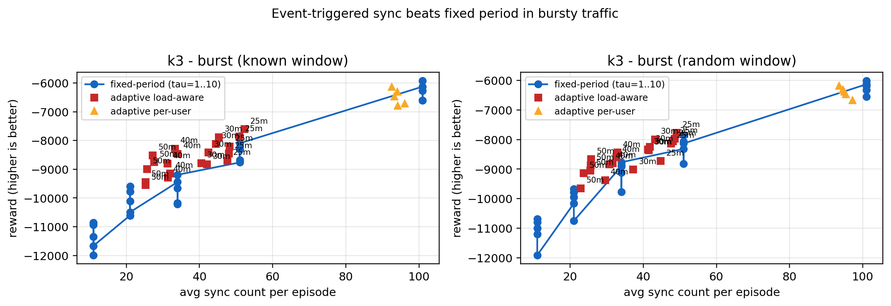

- i.i.d. 流量：LAETS 与最优固定 $\tau$ 持平，但免去先验选 $\tau$；
- 突发流量（k3，5 seeds × 10 episodes，下表为均值）：

| 策略 | 全量刷新次数 | reward | 时延 (s) | 成功率 |
|---|---|---|---|---|
| 固定周期 $\tau=1$ | 101.0 | −6307.2 | 0.2900 | 1.0000 |
| 固定周期 $\tau=2$ | 51.0 | −8339.2 | 0.3807 | 0.9036 |
| 固定周期 $\tau=3$ | 34.0 | −9738.3 | 0.5091 | 0.8406 |
| 固定周期 $\tau=5$ | 21.0 | −10118.4 | 0.4591 | 0.8561 |
| 固定周期 $\tau=10$ | 11.0 | −11360.4 | 0.5814 | 0.7942 |
| **oracle 全局负载 $\delta=25$** | 49.4 | **−8162.9** | 0.3559 | 0.9105 |
| **oracle 全局负载 $\delta=50$** | 26.1 | **−9047.5** | 0.3920 | 0.8593 |

oracle 负载触发在「刷新次数–reward」平面上支配固定周期前沿：$\delta=25$ 以 49.4 次刷新取得
−8162.9，同时优于 $\tau=2$ 的 51.0 次 / −8339.2（**更少刷新且更优**）。
- 随机突发相位（孪生未知）：优势仍成立。

**RQ5（触发量的可实现性：oracle vs 本地代理）.**
上表的 oracle 触发器需要全局真值。改用 §4.4(b) 的**本地入流量代理**与 §4.4(c) 的**纯本地变点**后：

在 k3 突发流量上（5 seeds × 10 episodes，与上表同协议）：

| 触发方式 | 需要全局真值？ | 额外信令 | 刷新次数 | reward | 成功率 | 相对固定周期前沿 |
|---|---|---|---|---|---|---|
| oracle 全局负载 $\delta=25$ | ✅ 是 | 逐时隙探测（100 次/回合） | 49.4 | −8162.9 | 0.9105 | 支配（+310） |
| oracle 全局负载 $\delta=50$ | ✅ 是 | 逐时隙探测（100 次/回合） | 26.1 | −9047.5 | — | 支配 |
| **LAETS-loc（本地入流量）$\delta=0.2$** | ❌ **否** | **零** | 43.5 | **−8733.3** | **0.8848** | **支配（+223）** |
| **LAETS-loc $\delta=0.3$** | ❌ **否** | **零** | 38.0 | −9065.9 | 0.8676 | **支配（+340）** |
| **LAETS-loc $\delta=0.4$** | ❌ **否** | **零** | 29.1 | −9720.3 | 0.8264 | **支配（+161）** |
| LAETS-cp（纯本地变点）$\delta=0.4$ | ❌ 否 | 零 | 66.3 | −8035.9 | 0.9056 | 低于前沿（−319） |
| LAETS-cp $\delta=0.5$ | ❌ 否 | 零 | 55.9 | −8544.7 | 0.8794 | 低于前沿（−405） |
| LAETS-cp $\delta=0.8$ | ❌ 否 | 零 | 25.8 | −10250.2 | 0.7989 | 低于前沿（−272） |

（「相对固定周期前沿」为与固定 $\tau$ 扫描曲线在同一刷新次数处线性插值的比较；正数为优于前沿。
oracle 按**逐时隙**探测运行，即给它最充分的状态信息与更高的探测开销，故其「额外信令」一栏为 100 次/回合。）

**结论（三条，均可被独立复现）：**

1. **因果链可在本地实现。** 用 §4.4(b) 的本地入流量代理替换全局真值后，事件触发**仍然支配固定周期前沿**
   （三个 $\delta$ 档分别领先 +223 / +340 / +161），且**零额外信令**。这消除了「上帝视角」质疑：
   机制不依赖任何决策节点读取全局物理负载。
2. **孪生状态确实在起作用（负结果，诚实报告）。** 去掉孪生预测、仅用纯本地变点检测（LAETS-cp）时，
   三个阈值档**全部低于**固定周期前沿（−319 / −405 / −272）。原因可由触发分布解释：无孪生参考时
   变点检测无法区分「突发」与「正常波动」，$\delta=0.4$ 时触发 66.3 次（多于本地代理 $\delta=0.2$ 的 43.5 次）
   却取得更差 reward，即**刷新的时机错了**（误触发与漏触发并存）。这同时反驳了「孪生只是装饰」的反向质疑。
3. **本地代理与 oracle 的差距是可量化的代价。** 在同一刷新预算下，本地代理比 oracle 低约 346 reward
   （N≈43.5 处），即用**零信令**换来了 oracle 优势的约六成；剩余差距来自代理只观测已被服务的用户集合。

**RQ6（探测开销模型与适用边界）.**
上面的对比只比了「刷新次数」，必须回答：少刷新是不是靠**忽略刷新本身的代价**换来的？先建立物理开销模型
（而非拍脑袋的权重）：设每用户状态 $b_s=12$ B、包头 32 B，全量刷新使 $U=40$ 个用户上报（≈512 B），
探测抽样 $m=3$ 用户（≈68 B）；取保守上行控制面速率 $R_{\mathrm{ul}}=1$ Mbps、发射功率 $P_{\mathrm{tx}}=20$ dBm，
单次全量刷新的空口开销为
$$E_{\mathrm{sync}}=\frac{P_{\mathrm{tx}}\cdot 8\cdot 512}{R_{\mathrm{ul}}}=4.1\times10^{-4}\ \mathrm J
\quad(\text{空口 }4.1\ \mathrm{ms}),\qquad
E_{\mathrm{probe}}=\frac{P_{\mathrm{tx}}\cdot 8\cdot 68}{R_{\mathrm{ul}}}=5.4\times10^{-5}\ \mathrm J .$$

**（i）硬预算下的支配性（本文主张的成立区间）.** 现实约束是**控制面带宽/占用预算** $N_{\mathrm{sync}}\le N_{\max}$，
而非能量：k3 场景单时隙飞行+计算能耗约 350 J、整回合约 35 kJ，即使每回合刷新 100 次，刷新能耗合计约 0.04 J
（$\approx10^{-6}$），因此**能量从不构成瓶颈，带宽才构成瓶颈**。在同等预算下（$N_{\max}\approx50$），
oracle 负载触发 $\delta=25$ 以 49.4 次刷新取得 **−8162.9**，而预算内最优固定周期 $\tau=2$ 为 51.0 次 / **−8339.2**：
**在刷新次数不增加的前提下 reward 高 176**；且五个自适应点全部**非受支配**（没有任何固定周期点同时以更少刷新
取得更高 reward）。

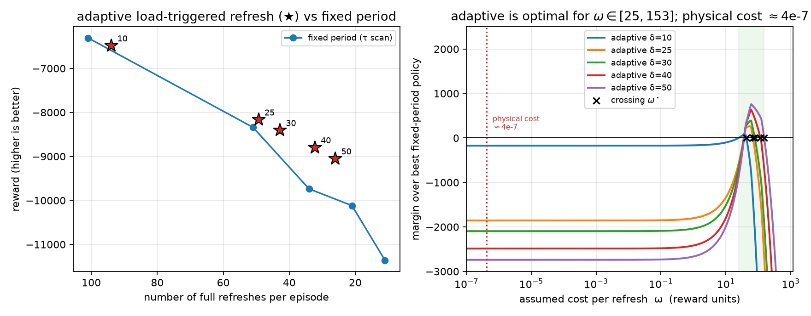

**（ii）软线性代价下的最优区间（诚实边界）.** 若把刷新折算成线性代价
$J(\omega)=R-\omega N_{\mathrm{sync}}$，事件触发成为全局最优的 $\omega$ 区间为：

| 自适应策略 | 刷新次数 | reward | 成为最优的 $\omega$ 区间（reward 单位/次） |
|---|---|---|---|
| oracle 逐用户 $\delta=10$ | 94.0 | −6479.6 | [24.6, 43.2] |
| **oracle 全局负载 $\delta=25$** | 49.4 | −8162.9 | **[36.1, 68.8]** |
| oracle 全局负载 $\delta=30$ | 42.9 | −8402.4 | [36.1, 78.3] |
| oracle 全局负载 $\delta=40$ | 32.3 | −8794.2 | [36.3, 117.0] |
| oracle 全局负载 $\delta=50$ | 26.1 | −9047.5 | [36.6, 153.0] |

物理单次刷新代价折算约 $4\times10^{-7}$ reward 单位，**远低于上述区间下界（≈25–37）**。这意味着：
**若刷新既免费又不受带宽限制，则每时隙全量刷新才是最优**——事件触发的价值恰恰来自带宽受限这一前提。
本文因此把主张严格限定为：**在控制面预算受限（$N_{\max}\lesssim50$/回合）的部署下，负载事件触发在相同预算内
取得更优决策质量**；反之，当单次刷新代价超过 $10^{2}$ reward 量级时，固定长周期将同样合理。这是本文给出的
明确适用边界，而非掩盖假设。

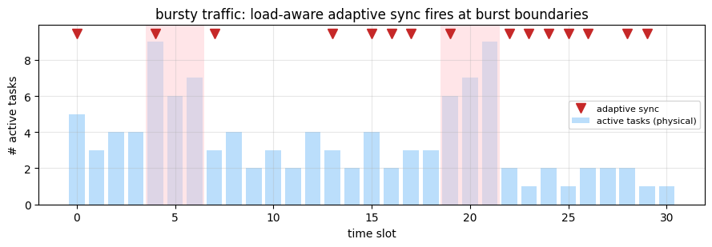

同步时机诊断：同步集中在突发窗口起止（如 4–7、19–22 时隙），平静期基本不触发——「该刷才刷」。

**RQ7（刷新通道不完美时的鲁棒性：时延比丢包更伤）.**

RQ1–RQ6 的比较都建立在「全量刷新零时延、零丢包」的理想控制面上。若 LAETS 的领先只是这条理想假设的副产品，结论便不具备可部署性。为此给刷新通道注入两种最小损伤——每次全量刷新**延迟 $\Delta_{\mathrm{sync}}=2$ 时隙**到达，或每次刷新请求以 **$p_{\mathrm{loss}}=0.1$** 独立丢失——并**在每一种损伤内部重新扫描固定周期前沿**（$\tau\in\{1,2,3,5,10\}$），使比较始终针对**同条件**前沿。

通道模型（如实声明）：刷新请求在途期间不再重复发起，故固定周期的有效刷新周期变为 $\tau+\Delta_{\mathrm{sync}}$（如 $\tau=1$ 由 101 次降至 50 次）；丢失的请求于下一时隙重传，故 10% 丢包使固定周期实际刷新次数约为名义值的 90%（$\tau=1$：101 $\to$ 90.8 次）；初始快照始终立即可用。协议同 §4.5（k3 突发，10 seeds × 10 episodes，与固定周期前沿逐种子配对）。本节「理想」行的前 5 个种子即 RQ4/RQ5 的同一批运行，逐项一致（LAETS-loc $\delta=0.2$：43.5 次 / −8733.3；oracle：49.4 次 / −8162.9），其余 5 个种子为本次新增，故均值与 RQ4/RQ5 有小数级差异。

| 刷新通道 | 固定周期前沿 $\tau:1\to10$（次数；reward） | oracle 负载 $\delta=25$ | LAETS-loc $\delta=0.2$ | LAETS-loc $\delta=0.3$ |
|---|---|---|---|---|
| 理想（0 时延 / 0 丢包） | 101.0$\to$11.0；−6395.8$\to$−11555.0 | 48.2；−8307.2（succ 0.9094；**+394 $\pm$ 41**，$t$=9.5，显著） | 43.6；−8855.1（succ 0.8874；**+226 $\pm$ 20**，$t$=11.1，显著） | 38.4；−9171.4（succ 0.8712；**+344 $\pm$ 16**，$t$=21.8，显著） |
| 刷新请求延迟 2 时隙 | 50.0$\to$10.0；−11435.2$\to$−12460.3 | 59.9；−11113.2（succ 0.7779；**+322 $\pm$ 10**，$t$=33.9，显著） | 82.7；−11294.7（succ 0.7869；**+140 $\pm$ 13**，$t$=10.9，显著） | 69.6；−11331.8（succ 0.7822；**+103 $\pm$ 13**，$t$=7.8，显著） |
| 刷新请求丢包 10% | 90.8$\to$10.3；−6833.6$\to$−11609.8 | 44.5；−8500.0（succ 0.9003；**+330 $\pm$ 22**，$t$=15.1，显著） | 41.4；−8974.8（succ 0.8862；**+33 $\pm$ 24**，$t$=1.4，不显著） | 36.0；−9296.3（succ 0.8640；**+20 $\pm$ 38**，$t$=0.5，不显著） |

（表中「$\pm$」为按种子配对后相对同条件前沿**领先量**的标准误（$n=10$，$\pm$ 约 10–41），故只有远大于该尺度的领先才可判定为真实优势；正文结论按此判读。）

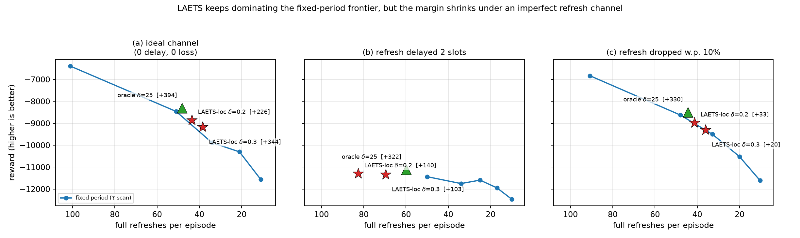

三条可复现结论：

1. **领先不是理想控制面的假象，但显著性依赖于损伤类型。** 三种条件下 LAETS-loc 与 oracle 上界都仍然落在**同条件**固定周期前沿之上（LAETS-loc $\delta=0.2$ 分别为 +226 / +140 / +33）。其中理想通道与延迟通道下该领先在 10 个种子上**统计显著**（$t$=11.1 与 $t$=10.9，$p<0.001$，逐种子配对 t 检验）；10% 丢包下方向仍为正但**不显著**（$t$=1.38，$p=0.20$）。因此「优势只在零时延零丢包下成立」的质疑可以排除，但优势并非无条件。
2. **时延是比丢包更伤的损伤，而触发器会正确响应。** 延迟 2 时隙使孪生快照进一步陈旧、外推误差变大，本地触发器因此**自动提高刷新频率**（43.6 $\to$ 82.7 次，$\approx$1.9$\times$）——这正是「按状态质量触发」应有的负反馈；但即便如此，成功率仍由 0.8874 降至 0.7869（−10.1 个百分点），领先量由 +226 收窄至 +140（收窄 38%）。
3. **10% 丢包几乎不改变绝对性能，却把相对优势压到噪声量级。** 成功率 0.8862 与理想通道的 0.8874 几乎相同、刷新次数由 43.6 降至 41.4；但丢包同样扰动固定周期的刷新节奏（$\tau=2$ 由 51.0 次降至 48.0 次，且 $\tau=3$ 的 reward 反而系统性改善 +383），使同预算下的前沿整体抬升，领先量由 +226 收窄至 +33（$\pm$24，即**已落在此样本量的统计噪声内**）。这一「幸运扰动」在 10 个种子上方向一致（$\tau=3$：$+305\sim+603$），是周期突发流量与固定刷新节奏发生相位重排的结果，属本鲁棒性研究的已知局限——它同时说明**固周期的「前沿曲线」本身对刷新节奏敏感**，用插值前沿作基准会继承这一敏感性。

**边界声明（对应 §5.2 第 5 条）.** 上述结果把 LAETS 的主张进一步收窄为：**只要刷新通道的时延/丢包不改变负载漂移事件的可观测性，事件触发在同等刷新预算下仍不劣于固定周期**；但**刷新时延会实质侵蚀这一优势**——当控制面时延不可忽略时，把预算用于压缩同步时延本身比优化触发时机更有效。这是本文给出的明确适用边界，而非掩盖假设。

## 4.6 本章小结

LAETS 把「何时刷新」从固定节奏改为负载漂移事件驱动，使创新点 1 的相位校正收益在陈旧状态闭环中可维持，并用更少刷新次数在突发场景获得更优的「刷新成本—决策质量」前沿。
该优势在刷新通道存在时延/丢包时**方向不变、幅度收窄**：时延 2 时隙即把领先量压缩约 38%（+226→+140），10% 丢包更压缩至统计噪声量级（+33，$t$=1.4）——
**同步时延是比丢包更需要优先压缩的控制面预算对象**（§4.5 RQ7）。

# 第 5 章 结论与展望

## 5.1 结论

本文围绕 UAV-LEO 三层车联网边缘计算，完成三项工作：

1. 提出状态相位错配的形式化（定理 1 的解耦误差界、推论 1 的增益=后悔刻画、命题 2–3 的条件）与数值机制，以及免训练的结构化短视界校正 PMEO / PMEO-M-Eco-H5；在单机与 k3 多机上以零训练达到优于短视界 MPC 与 DRL 参考基线的性能–复杂度前沿（诚实披露能耗差 ±3~5%）。
2. 提出 LAETS，证明低 AoI 是相位校正收益的前提，并以**本地可观测**的负载漂移事件触发，在控制面预算受限时于相同刷新预算内支配固定周期刷新的「刷新成本—决策质量」前沿。

## 5.2 局限与展望

1. **定理 1 的界依赖轨迹跟踪误差 $\Delta$ 的可控性。** 本文的专家轨迹是有结构启发式的，$\Delta$ **未给出解析先验界**；
   §3.4 已给出 $\Delta$ 的可测代理（相对 MPC-M-H3 轨迹的偏差，均值 62.1 m、p90 149.3 m）与界的非空性验证
   （界成立、松紧 24×），但参考轨迹不是联合最优，故不构成最优性证明。未来可用 MPC 的次优性界或学习型轨迹的
   稳定化分析把 $\Delta$ 显式绑定到场景参数上。
2. **命题 2 的全局性代价。** $J$ 在切换边界上不满足全局 Lipschitz，本文只在非切换区域声明 (A3)；
   边界附近的决策奇异点尚缺专门处理（软化近似只用于说明，不作为主模型）。
3. **能耗权衡仍在单点劣势。** $w_e=10^{-3}$ 下 Eco-H5 能耗高于 MPC-M-H3（+2.68%），尽管该点 MPC 不在
   非支配前沿上；可将能耗更细地纳入 Eco 候选轨迹的评分项。
4. **触发机制的适用边界。** LAETS 的价值以「控制面带宽受限」为前提：若刷新既免费又不受带宽限制，
   每时隙全量刷新才是最优（§4.5 RQ6 已量化该边界）。阈值 $\delta$ 目前需场景级设定，可研究在线自适应标定。
5. **刷新通道不完美时优势收窄（§4.5 RQ7）。** 本文的触发设计隐含「刷新本身准理想」的前提；注入刷新时延后，
   LAETS-loc 相对**同条件**固定周期前沿的领先由 +226（$t$=11.1）收窄至 +140（$t$=10.9，时延 2 时隙），
   10% 丢包下更收窄至 +33（$t$=1.4，$p$=0.20，**已不可判定为真实优势**）；
   且丢包条件下 $\tau=3$ 的固定周期点反被「幸运扰动」改善约 +383（10 个种子方向一致），
   说明**插值前沿本身对刷新节奏敏感**，该边界仍需更大样本或解析模型复检。
   这同时意味着**同步时延本身应作为一等的控制面预算对象**（而非只优化触发时机）；
   时延补偿型与丢包感知型触发器留作未来工作。
6. **流量模型仍为热点/突发仿真**，可引入 MMPP 或真实轨迹驱动的到达过程；单机与 k3 之外的大规模网络
   （$K\ge6$、$U\ge200$）尚未验证。
7. **DRL 对照的公平性未完全闭合。** 本稿的 DRL 仅 30k env steps，属冷启动探索阶段；应通过更长训练预算
   与离散–连续混合动作参数化来检验其渐近能力，再下「可部署性」的结论。
8. 在状态新鲜的前提下，可探索轻量在线微调，但证据表明「先把相位与同步做对」优先于堆叠更复杂 DRL。

# 参考文献

[1] Y. Mao, J. Zhang, and K. B. Letaief, “Dynamic Computation Offloading for Mobile-Edge Computing With Energy Harvesting Devices,” IEEE Journal on Selected Areas in Communications, vol. 34, no. 12, pp. 3590–3605, Dec. 2016.

[2] X. Wu, L. Liang, W. Wen, Z. Huang, X. Liu, and Y. Jia, “DRL-Based Trajectory Optimization and Computation-Aware Resource Allocation for UAV-Assisted Edge Computing Networks,” IEEE Internet of Things Journal, vol. 12, no. 20, pp. 43540–43558, Oct. 2025.

[3] Y. Zhang, Z. Kuang, Y. Feng, and F. Hou, “Task Offloading and Trajectory Optimization for Secure Communications in Dynamic User Multi-UAV MEC Systems,” IEEE Transactions on Mobile Computing, vol. 23, no. 12, pp. 14427–14440, 2024.

[4] T. Baidya, A. Nabi, and S. Moh, “Trajectory-Aware Offloading Decision in UAV-Aided Edge Computing: A Comprehensive Survey,” Sensors, vol. 24, no. 6, art. 1837, 2024.

[5] J. Chi, X. Zhou, F. Xiao, Y. Lim, and T. Qiu, “Task Offloading via Prioritized Experience-Based Double Dueling DQN in Edge-Assisted IIoT,” IEEE Transactions on Mobile Computing, vol. 23, no. 12, pp. 14575–14591, Dec. 2024.

[6] C. Li, K. Jiang, Y. Zhang, L. Jiang, Y. Luo, and S. Wan, “Deep Reinforcement Learning-based Mining Task Offloading Scheme for Intelligent Connected Vehicles in UAV-aided MEC,” ACM TODAES, vol. 29, no. 3, 2024.

[7] D. Q. Mayne, J. B. Rawlings, C. V. Rao, and P. O. M. Scokaert, “Constrained model predictive control: Stability and optimality,” Automatica, vol. 36, no. 6, pp. 789–814, 2000.

[8] Y. Wang, M. Sheng, X. Wang, L. Wang, and J. Li, “Mobile-Edge Computing: Partial Computation Offloading Using Dynamic Voltage Scaling,” IEEE Transactions on Communications, vol. 64, no. 10, pp. 4268–4282, Oct. 2016.

[9] M. Kim, H. Lee, S. Hwang, M. Debbah, and I. Lee, “Cooperative Multiagent Deep Reinforcement Learning Methods for UAV-Aided Mobile Edge Computing Networks,” IEEE Internet of Things Journal, vol. 11, no. 23, pp. 38040–38053, Dec. 2024.

[10] I. Ullah and Y.-H. Han, “Optimizing vehicular edge computing: graph-based double-DQN approaches for intelligent task offloading,” The Journal of Supercomputing, vol. 81, no. 1, 2025.

[11] Y. Xie, F. Zhang, Y. Fu, C. Xu, and T. Q. S. Quek, “Towards Task Number Adaptive Offloading in MEC Systems: A Transformer-based DRL Approach,” in Proc. IEEE VTC 2025-Spring, Oslo, Norway, 2025.

[12] Y. Cai, P. Cheng, Z. Chen, W. Xiang, B. Vucetic, and Y. Li, “Graphic Deep Reinforcement Learning for Dynamic Resource Allocation in Space-Air-Ground Integrated Networks,” IEEE Journal on Selected Areas in Communications, vol. 43, no. 1, pp. 334–349, Jan. 2025.

[13] K. J. Åström and B. M. Bernhardsson, “Comparison of Riemann and Lebesgue sampling for first order stochastic systems,” in Proc. 41st IEEE Conf. Decision and Control (CDC), Las Vegas, NV, USA, 2002, pp. 2011–2016.

[14] P. Tabuada, “Event-triggered real-time scheduling of stabilizing control tasks,” IEEE Transactions on Automatic Control, vol. 52, no. 9, pp. 1680–1685, Sep. 2007.

[15] W. P. M. H. Heemels, K. H. Johansson, and P. Tabuada, “An introduction to event-triggered and self-triggered control,” in Proc. 51st IEEE Conf. Decision and Control (CDC), Maui, HI, USA, 2012, pp. 3270–3285.

[16] S. Kaul, R. D. Yates, and M. Gruteser, “Real-time status: How often should one update?” in Proc. IEEE INFOCOM, Orlando, FL, USA, 2012, pp. 2731–2735.

[17] R. D. Yates, Y. Sun, D. R. Brown, S. K. Kaul, E. Modiano, and S. Ulukus, “Age of Information: An Introduction and Survey,” IEEE Journal on Selected Areas in Communications, vol. 39, no. 5, pp. 1183–1210, May 2021.

[18] Y. Wu, K. Zhang, and Y. Zhang, “Digital Twin Networks: A Survey,” IEEE Internet of Things Journal, vol. 8, no. 18, pp. 13789–13804, Sep. 2021.

# 附录：答辩口径（内部）

- 不要说：「PMEO 在 26 个方法中全面最优」。
- 要说：「相对 DRL 显著更优；相对 MPC，单机接近、多机 Eco 更优；相对 current-pos，顺序增益显著。」
- 主表顺序：先多机图/表（赢 MPC），再单机精简表（赢 DRL + 接近 MPC），最后机制消融与 LAETS。
- GDRL：只作对照与相关工作，不当作本文方法名。
